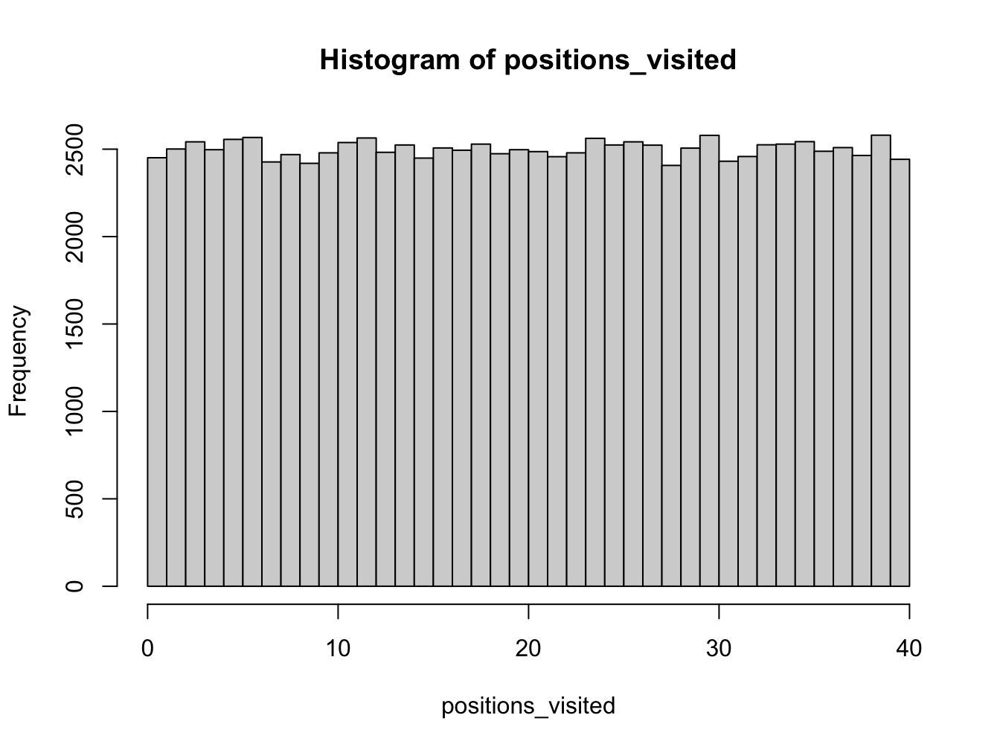
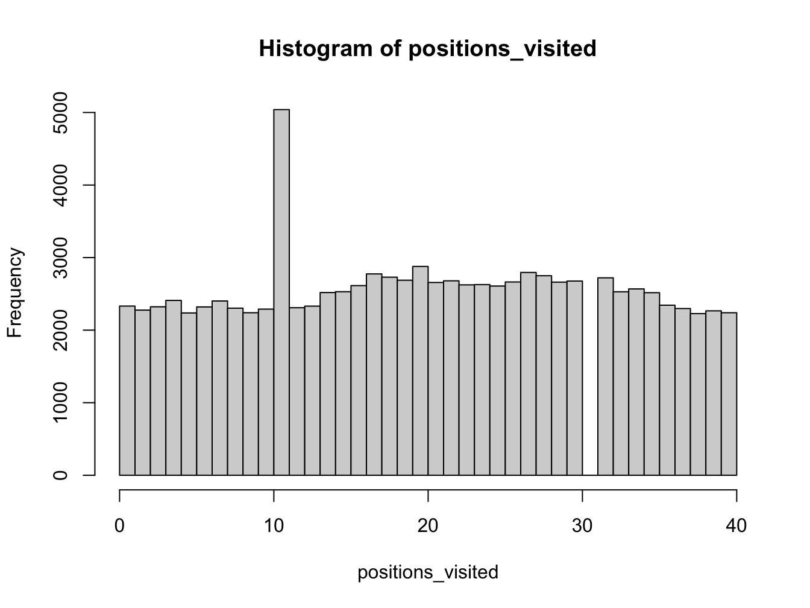

# A Monopoly simulation

Now you will use to simulate simplified games of Monopoly (https://en.wikipedia.org/wiki/Monopoly_(game)). In addition, there are also many tutorials and guides on the Web describing how to produce computer simulations for Monopoly. You are welcome to read and use these examples to inspire your work.

## Moving around the board

A Monopoly board has 40 spaces. Players take it in turns to roll two dice and traverse around the board according to the sum of the dice values.

Use the following code example to simulate turns of a single player:


```{.r .numberLines}
num_turns <- 100000 # number of turns to take

current_board_position <- 0 # start on the GO space

move_size <- rep(0, num_turns)
positions_visited <- rep(0, num_turns)

# use a for loop to simulate a number of turns
for (turn in 1:num_turns) {

  # roll two dice
  die_values <- sample(c(1:6), 2, replace = TRUE)

  # move player position

  # number of positions to move
  plus_move <- sum(die_values)

  # compute new board position
  new_board_position <- current_board_position + plus_move

  # update board position (this corrects for the fact the board is circular)
  current_board_position <- (new_board_position %% 40)

  # store position visited
  positions_visited[turn] <- current_board_position

}
```


By increasing the number of turns taken, what distribution does the set of simulated board positions converge towards? Show this graphically using the histogram function.


```{.r .numberLines}
hist(positions_visited, breaks = seq(0, 40, len = 41), right = FALSE)
```



## Going to Jail

If a player lands on to Go To Jail space they must move immediately to the Jail space. Extend your code to include the possibility of going to jail. Here, assume that once in jail, the player continues as normal on the next turn.


```{.r .numberLines}
 num_turns <- 100000 # number of turns to take

current_board_position <- 0 # start on the GO space
go_to_jail_position <- 30 # the go to jail space
jail_position <- 10 # jail space

move_size <- rep(0, num_turns)
positions_visited <- rep(0, num_turns)

# use a for loop to simulate a number of turns
for (turn in 1:num_turns) {

  # roll two dice
  die_values <- sample(c(1:6), 2, replace = TRUE)

  # move player position

  # number of positions to move
  plus_move <- sum(die_values)

  # compute new board position
  new_board_position <- current_board_position + plus_move

  # if land on GO TO JAIL square, then go backwards to the JAIL square
  if (new_board_position == go_to_jail_position) {
    new_board_position <- jail_position
  }

  # update board position (this corrects for the fact the board is circular)
  current_board_position <- (new_board_position %% 40)

  # store position visited
  positions_visited[turn] <- current_board_position

}
```

::: {.infobox}
## Exercise

> What is the distribution of board positions during a long game?


```{.r .numberLines}
hist(positions_visited, breaks = seq(0, 40, len = 41), right = FALSE)
```



> Can you explain this result qualitatively?

Discuss with your neighbour and the instructor.
:::


::: {.infobox}
## Exercise

You can also go to jail, if you roll three doubles (both dice having the same value) in a row. Update your code to allow for the possibility of going to Jail with three doubles. How does the distribution of board positions change?

<button class="button">
  [Show Solution](#3doubleMon)
</button>
:::

::: {.infobox}
## Exercises: Extend the game

Now consider building a more complex Monopoly simulation by incorporating more complex aspects of the game such as:

-   the purchase of properties
-   a ledger for each player
-   chance and community cards

You will need to think carefully about the simplifying assumptions you will make to make the task achievable. Do not be over-ambitious. For example, you might initially assume that players will not build houses/hotels on properties.

Here are some questions to answer with your simulations:

1.  How many turns does it take before all properties are purchased?
2.  What are the best properties to buy?
3.  How long does it take for a winner to be determined?
<button class="button">
  [Show Solution](#monopolyExtSol)
</button>
:::
