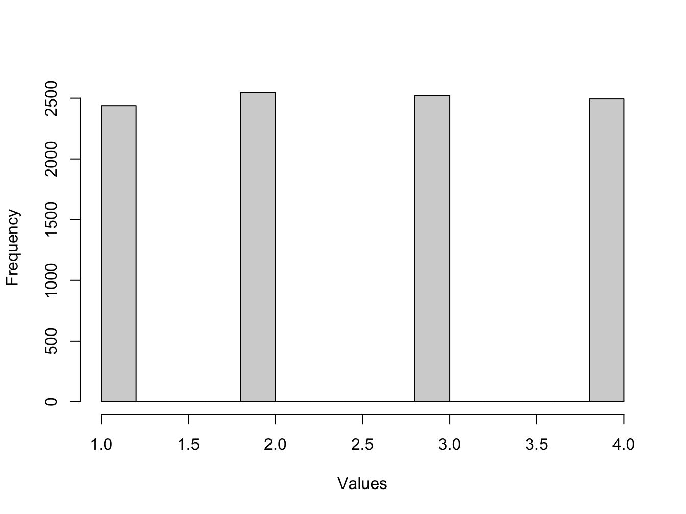

# Simulating random numbers {#simulating-random-numbers}

There are a number of functions in `R` that you can use to simulate random numbers according to different probability distributions.

The function `sample` allows you to take a sample of the specified size from the elements of a vector `x`using sampling with or without replacement. You can use `?sample` to read the documentation describing the command.

In the following, we will use the `sample` function to make 10,000 draws from the set of numbers `1`, `2`, `3` and `4` and display the distribution of the sampled values using a histogram.

First, we define a vector called `x` which contains the numbers `1`, `2`, `3`, and `4`. The function `c` allows us to combine these four numbers together into one vector:


```{.r .numberLines}
x <- c(1, 2, 3, 4)
```


We now use the function `sample` to pick from those four numbers in `x` 10,000 times. The result, the 10,000 numbers chosen, is store in `out`:


```{.r .numberLines}
out <- sample(x, 10000, replace=TRUE)
```

Lets plot a histogram of the values picked:


```{.r .numberLines}
hist_out <- hist(out, main = '', xlab = 'Values', ylab = 'Frequency')
```



We picked each number with equal probability so the histogram shows each number is equally likely to have been chosen.

::: {.infobox}
## Exercise

### Question
> What is the difference in the output `out1` and `out2` in the following piece of code?


```{.r .numberLines}
x <- c( 1, 2, 2, 3, 4, 1, 6, 7, 8, 10, 5, 5, 1, 4, 9 )
out1 <- sample(x, 10, replace=FALSE)
out2 <- sample(x, 10, replace=TRUE)
```

### Solution

The option `replace=TRUE` activates sampling with replacement (i.e. the numbers that are picked are put back and can be picked again).

The option `replace=FALSE` activates sampling without replacement (i.e. the numbers that are picked are not put back and cannot be picked again).
:::

::: {.infobox}
## Exercise

> Use the `sample` or `sample.int` function to simulate values from rolls of an unbiased six-sided die. Show that the distribution of values you obtain is consistent with an unbiased die.

*Hint 1*: Type `?sample.int` in the console to get help on this function.

*Hint 2*: You may find it useful to use the function `table`. Type `?table` in the console to get help on this function.


```{.r .numberLines}
rolls_from_sample = sample(c(1:6), size=5000, replace=TRUE)
rolls_from_sample.int = sample(6, size=5000, replace=TRUE)

table(rolls_from_sample)
```

```{.bg-info}
#> rolls_from_sample
#>   1   2   3   4   5   6 
#> 852 823 828 860 819 818
```


```{.r .numberLines}
table(rolls_from_sample.int)
```

```{.bg-info}
#> rolls_from_sample.int
#>   1   2   3   4   5   6 
#> 858 836 824 785 907 790
```

Both gives a uniform distribution over the numbers 1-6. The function `sample.int` is a specialised version of sample for sampling integers. Many `R` libraries have specialised versions of more general functions to do specific tasks under certain conditions.
:::
