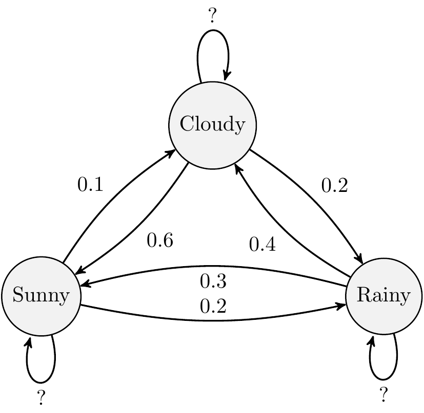

#  Solution: 3 state Markov Chain {- #mc-solution}


Set up a 3x3 transition matrix:


```{.r .numberLines}
transitionMatrix = matrix(c(0.7, 0.2, 0.1,
                            0.3, 0.3, 0.4,
                            0.6, 0.2, 0.2), nrow=3, ncol=3, byrow=TRUE)

# Check matrix set-up correctly
print(transitionMatrix)
```

```{.bg-info}
#>      [,1] [,2] [,3]
#> [1,]  0.7  0.2  0.1
#> [2,]  0.3  0.3  0.4
#> [3,]  0.6  0.2  0.2
```

Note the ordering of the states is arbitrary but here we have used the convention that State 1 is Sunny, State 2 is Rainy and State 3 is Cloudy which means the probabilities are completed in that order in the transition matrix. We just need to be consistent.


```{.r .numberLines}
state <- 1 # initial state - it is [1] sunny, [2] rainy and [3] cloudy
weather_sequence <- rep(0, 30) # vector to store simulated values

# simulate for 30 days
for (day in 1:30) {
  pr <- transitionMatrix[state, ] # select the row of transition probabilities

  # sample [1-3] based on the probs pr
  state <- sample(c(1, 2, 3), size = 1, prob = pr)
  weather_sequence[day] <- state # store the sampled state
}
print(weather_sequence)
```

```{.bg-info}
#>  [1] 1 3 3 1 1 2 3 2 3 1 1 1 1 1 3 1 1 1 2 2 3 1 3 3 1 1 1 1
#> [29] 1 2
```
