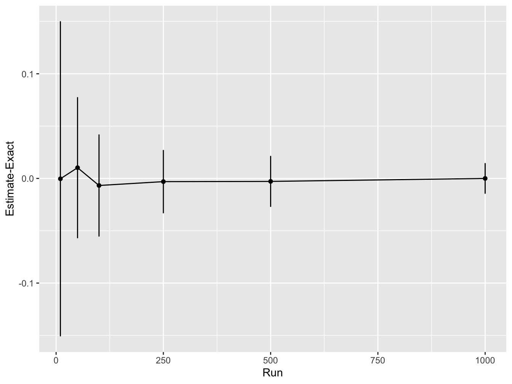
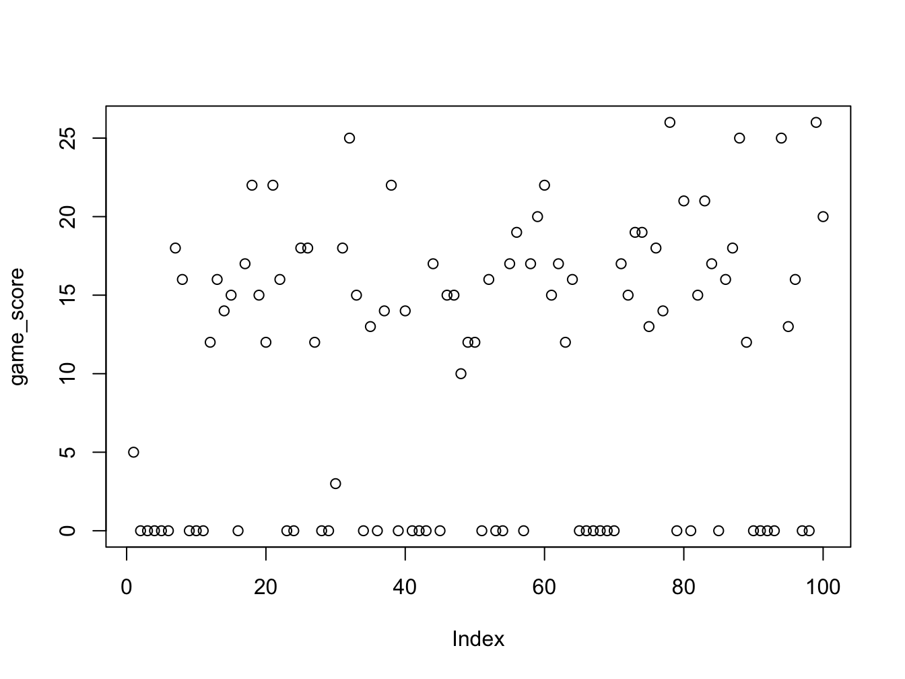

# Monte Carlo Methods

Monte Carlo (MC) simulations provide a means to model a problem and apply brute force computational power to achieve a solution - randomly simulate from a model until you get an answer. The idea is similar to what we went through in the lecture. The best way to explain is to just run through a bunch of examples, so lets go!

## Integration

We will start with basic integration. You are not required to know how to perform an integration by hand, but in the context of continuous RVs you should understand how to perform an integration using MC and what it means. Throughout this exercise try to relate it back to what you saw during the lecture and the information each integral provides.

Suppose we have an instance of a Normal distribution with a mean of 1 and a standard deviation of 2 then we want to find the *integral* (area under the curve) from 1 to 3:

\[
 \int_1^3 \frac{1}{10 \sqrt{2\,\pi}}\, e^{- \frac{(x - 1)^2}{2\times 2^2}}dx
\]

which we can visualise as follows:


If you have not done calculus before - do not worry. We are going to write a Monte Carlo approach for estimating this integral which does not require any knowledge of calculus!

The method relies on being able to generate samples from this distribution and counting how many values fall between 1 and 3. The proportion of samples that fall in this range over the total number of samples gives the area.

First, create a new `R` script in `Rstudio`. Next we define the number of samples we will obtain. Lets start by choosing 1,000


```{.r .numberLines}
n <- 1000 # number of samples to take
```

Now we use the `R` function `rnorm` to simulate 100 numbers from a Normal distribution with mean 1 and standard deviation 2:


```{.r .numberLines}
sims <- rnorm(n, mean = 1, sd = 2) # simulated normally distributed numbers
```

Lets estimate the integral between 1 and 3 by counting how many samples had a value in this range:


```{.r .numberLines}
# find proportion of values between 1-3
mc_integral <- sum(sims >= 1 & sims <= 3) / n
```
The result we get is:


```{.r .numberLines}
print(mc_integral)
```

```{.bg-info}
#> [1] 0.311
```

<!-- TODO: Add some context about sims and mc_integral -->

The exact answer given using the cumulative distribution function `pnorm` in R is given by:


```{.r .numberLines}
mc_exact = pnorm(q=3, mean=1, sd=2) - pnorm(q=1, mean=1, sd=2)
print(mc_exact)
```

```{.bg-info}
#> [1] 0.3413447
```

The `pnorm` gives the integral under the Normal distribution (in this case with mean 1 and standard deviation 2) from negative infinity up to the value specified by `q`.

The first call to `pnorm(q=3, mean=1, sd=2)` gives us this integral:


The second call to `pnorm(q=1, mean=1, sd=2)` gives us this integral:


Therefore the difference between these gives us the integral of interest.

::: {.rmdnote }
<center>
**The Monte Carlo estimate is a fairly good approximation to the true value!**
</center>
:::

::: {.infobox}
## Exercise: MC accuracy {#mc-accuracy}

> 1. Try increasing the number of simulations and see how the accuracy improves?
> 2. Can you draw a graph of number of MC samples vs accuracy?

<button class="button">
  [Show Solution](#solution-mc-accuracy)
</button>
:::

## Approximating the Binomial Distribution

We flip a coin 10 times and we want to know the probability of getting more than 3 heads. This is a trivial problem using the Binomial distribution but suppose we have forgotten about this or never learned it in the first place.

Lets solve this problem with a Monte Carlo simulation. We will use the common trick of representing tails with 0 and heads with 1, then simulate 10 coin tosses 100 times and see how often that happens.


```{.r .numberLines}
runs <- 100 # number of simulations to run

greater_than_three <- rep(0, runs) # vector to hold outcomes

# run 100 simulations
for (i in 1:runs) {

  # flip a coin ten times (0 - tail, 1 - head)
  coin_flips <- sample(c(0, 1), 10, replace = T)

  # count how many heads and check if greater than 3
  greater_than_three[i] <- (sum(coin_flips) > 3)
}

# compute average over simulations
pr_greater_than_three <- sum(greater_than_three) / runs
```

For our MC estimate of the probability \(P(X>3)\) we get


```{.r .numberLines}
print(pr_greater_than_three)
```

```{.bg-info}
#> [1] 0.91
```

which we can compare to R’s built-in Binomial distribution function:


```{.r .numberLines}
print(pbinom(3, 10, 0.5, lower.tail = FALSE))
```

```{.bg-info}
#> [1] 0.828125
```

::: {.infobox}
## Problem: MC Binomial

> 1. Try increasing the number of simulations and see how the accuracy improves?
> 2. Can you plot how the accuracy varies as a function of the number of simulations? (hint: see the previous section)

:::

Not bad! **The Monte Carlo estimate is close to the true value.**

## Monte Carlo Expectations

Now we will consider a slightly different problem. Consider the following spinner. If the spinner is spun randomly then it has a probability 0.5 of landing on yellow and 0.25 of landing on red or blue respectively.


If the rules of the game are such that landing on *yellow* you gain 1 point,* red* you lose 1 point and *blue* you gain 2 points. We can easily calculate the expected score.

::: {.infobox}
<strong> THINK</strong>

How does this relate to probabilities? What is the random variable here and what type of RV are we dealing with?
:::

Let \(X\) denote the random variable associated with the score of the spin then:

\[
    E[X] = \frac{1}{2} \times 1 + \frac{1}{4} \times (-1) + \frac{1}{4} \times 2 = 0.75
\]

::: {.infobox}

## Exercise: MC Expectation 1 {#mc-expectation-1}
If we ask a more challenging question such as:

> **After 20 spins what is the probability that you will have less then 0 points?"**

How might we solve this?

Of course, there are methods to analytically solve this type of problem but by the time they are even explained we could have already written our simulation!

To solve this with a Monte Carlo simulation you need to sample from the Spinner 20 times, and return 1 if we are below 0 other wise we will return 0. We will repeat this 10,000 times to see how often it happens!

<button class="button">
  [Show Solution](#solution-mc-expectation-1)
</button>
:::

## Using Functions

First, we are going to introduce the concept of a function. You should have encountered it already before this module. This is a piece of code which is encapsulated so then we can refer to it repeated via the name of the function rather than repeatedly writing those lines of code. If you would like to learn more about functions in R, you can read [this](https://www.datacamp.com/community/tutorials/functions-in-r-a-tutorial) tutorial or the software carpentry [lesson](https://bham-carpentries.github.io/R-course-material/10-functions/index.html).

The function we will write will simulate one game as indicated above and return whether the number of points is less than zero.


```{.r .numberLines}
# simulates a game of 20 spins
play_game <- function(){
    # picks a number from the list (1, -1, 2)
    # with probability 50%, 25% and 25% twenty times
  results <- sample(c(1, -1, 2), 20, replace = TRUE, prob = c(0.5, 0.25, 0.25))

  # function returns whether the sum of all the spins is < 1
  return(sum(results) < 0)
}
```

## Simulating from function

Now we can use this function in a loop to play the game 100 times:


```{.r .numberLines}
runs <- 100 # play the game 100 times

less_than_zero <- rep(0, runs) # vector to store outcome of each game
for (it in 1:runs) {
  # play the game by calling the function and store the outcome
  less_than_zero[it] <- play_game()
}
```

We can then compute the probability that, after twenty spins, we will have less than zero points:


```{.r .numberLines}
prob_less_than_zero <- sum(less_than_zero)/runs
print(prob_less_than_zero)
```

```{.bg-info}
#> [1] 0
```

The probability is very low. This is not surprising since there is only a 25% chance of getting a point deduction on any spin and a 75% chance of gaining points. Try to increase the number of simulation runs to see if you can detect any games where you do find a negative score.

::: {infobox}
## Exercise: MC Expectation 2 {#mc-expectation-2}

1. Modify your code to allow you to calculate the expected number of points after 20 spins.
2. Simulate a game in which you have a maximum of 20 spins but you go “bust” once you hit a negative score and take this into account when you compute the expected end of game score.

<button class="button">
  [Show Solution](#solution-mc-expectation-2)
</button>
:::

#  Solution: Monte Carlo {-}

## Solution: MC accuracy {#solution-mc-accuracy}


First let's increase the number of simulations and out the accuracy


```{.r .numberLines}
sample_sizes <- c(10, 50, 100, 250, 500, 1000) # try different sample sizes
n_sample_sizes <- length(sample_sizes) # number of sample sizes to try
rpts <- 100 # number of repeats for each sample size
accuracy <- rep(0, n_sample_sizes) # vector to record accuracy values
accuracy_sd <- rep(0, n_sample_sizes) # vector to record accuracy sd values

# for each sample size
for (i in 1:n_sample_sizes) {

  sample_sz <- sample_sizes[i] # select a sanmple size to use

  # vector to store results from each repeat
  mc_integral <- rep(0, rpts)
  for (j in 1:rpts){
    # simulated normally distributed numbers
    sims <- rnorm(sample_sz, mean = 1, sd = 2)
    # find proportion of values between 1-3
    mc_integral[j] <- sum(sims >= 1 & sims <= 3) / sample_sz
  }

  # compute average difference between integral estimate and real value
  accuracy[i] <- mean(mc_integral - mc_exact)
  # compute sd difference between integral estimate and real value
  accuracy_sd[i] <- sd(mc_integral - mc_exact)

}

print(accuracy)
```

```{.bg-info}
#> [1] 2.655254e-03 5.055254e-03 2.855254e-03 1.525393e-05
#> [5] 1.055254e-03 1.295254e-03
```

```{.r .numberLines}
print(accuracy_sd)
```

```{.bg-info}
#> [1] 0.13730450 0.06418911 0.05346915 0.03150229 0.02089899
#> [6] 0.01424924
```

```{.r .numberLines}
print(accuracy + accuracy_sd)
```

```{.bg-info}
#> [1] 0.13995975 0.06924437 0.05632440 0.03151755 0.02195424
#> [6] 0.01554449
```

Next, we will plot the results. Here we will make use of `ggplot2` a library to create nice plots without much effort. The input need to be a `data.frame` so we will need to create one based on the data.


```{.r .numberLines}
# load ggplot
library(ggplot2)

# create a data frame for plotting
df <- data.frame(sample_sizes, accuracy, accuracy_sd)

print(df)
```

```{.bg-info}
#>   sample_sizes     accuracy accuracy_sd
#> 1           10 2.655254e-03  0.13730450
#> 2           50 5.055254e-03  0.06418911
#> 3          100 2.855254e-03  0.05346915
#> 4          250 1.525393e-05  0.03150229
#> 5          500 1.055254e-03  0.02089899
#> 6         1000 1.295254e-03  0.01424924
```

```{.r .numberLines}
# use ggplot to plot lines for the mean accuracy and error bars
# using the std dev
ggplot(df, aes(x = sample_sizes, y = accuracy)) +
  geom_line() +
  geom_point() +
  geom_errorbar(
      aes(ymin = accuracy - accuracy_sd, ymax = accuracy + accuracy_sd),
          width = .2,
          position = position_dodge(0.05)) +
  ylab("Estimate-Exact") +
  xlab("Run")
```



This shows that as the number of Monte Carlo samples is increased, the accuracy increases (i.e. the difference between the estimated integral value and real values converges to zero). In addition, the variability in the integral estimates across different simulation runs reduces.

<button class="button">
  [Back to Exercise](#mc-accuracy)
</button>

## MC Expectation

### Solution: MC Expectation 1 {#solution-mc-expectation-1}


```{.r .numberLines}
# simulates a game of 20 spins
play_game <- function() {
    # picks a number from the list (1, -1, 2)
    #  with probability 50%, 25% and 25% twenty times
  results <- sample(c(1, -1, 2), 20, replace = TRUE, prob = c(0.5, 0.25, 0.25))
  return(sum(results)) # function returns the sum of all the spins
}

score_per_game <- rep(0, runs) # vector to store outcome of each game
for (it in 1:runs) {
  score_per_game[it] <- play_game() # play the game by calling the function
}
expected_score <- mean(score_per_game) # average over all simulations

print(expected_score)
```

```{.bg-info}
#> [1] 14.75
```
<button class="button">
  [Back to Exercise](#mc-expectation-1)
</button>

### Solution: MC Expectation 2 {#solution-mc-expectation-2}


```{.r .numberLines}
# simulates a game of up to 20 spins
play_game <- function() {
    # picks a number from the list (1, -1, 2)
    #  with probability 50%, 25% and 25% twenty times
  results <- sample(c(1, -1, 2), 20, replace = TRUE, prob = c(0.5, 0.25, 0.25))
  results_sum <- cumsum(results) # compute a running sum of points
  # check if the game goes to zero at any point
  if (sum(results_sum <= 0)) {
    return(0) # return zero
  } else {
    return(results_sum[20]) # returns the final score
  }
}

game_score <- rep(0, runs) # vector to store scores in each game played

# for each game
for (it in 1:runs) {
  game_score[it] <- play_game()
}

print(mean(game_score))
```

```{.bg-info}
#> [1] 9.99
```

```{.r .numberLines}
plot(game_score)
```



The games with score zero now corresponds to the number of games where we went bust (or genuinely ended the game with zero).

<button class="button">
  [Back to Exercise](#mc-expectation-2)
</button>
