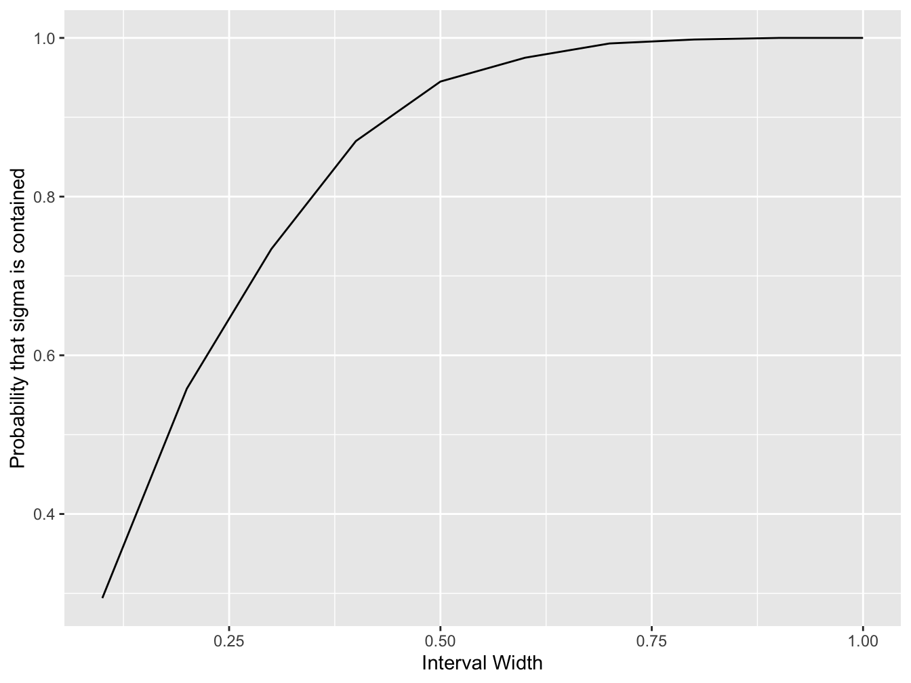

# Confidence Intervals

In this practical session, you will learn how to derive confidence intervals for a particular problem using Monte Carlo simulations.

In a random experiment, a sample of data is collected from which we can estimate a population parameter of interest. This estimate can either be a point estimate or an *interval estimate* - a range of values.

A **confidence interval** is an interval estimate which has an associated *confidence level*. The confidence level tells us the probability that the *procedure* that is used to construct the confidence interval will result in the interval containing the true population parameter. It is *not* the probability that the population parameter lies in the range.

This is a very counter-intuitive concept which we shall now illustrate in this exercise.

## Setup

First, create a new `R` script within Rstudio then we will start with some code preamble. We will use the package `ggplot2` for plotting. You can always create a plot using the base package and the `plot` function but `ggplot2` is a very powerful plotting package which we will use throughout the course.


```{.r .numberLines}
library(ggplot2)
```

Use `install.packages("ggplot2")` in the console window if the package is not installed on your system. If you are running your code on BearPortal it should already be installed, only use this function if you are running this code on your own machine.

Lets define the width of an interval, we will set this to 1 initially but we will change this later on:


```{.r .numberLines}
interval_width <- 1 # width of confidence interval
```

## Simulating data

We are now going to generate some simulated data for our experiment. We will create 30 samples from a Normal distribution with mean 2.5 and variance 1. These are *true* values of the population parameters. In a real experiment, we would not know these values but using simulated data, we obviously control these.

Let define these first:


```{.r .numberLines}
# number of data points to generate
n <- 30
# population mean
mu <- 2.5
# population standard deviation (square root of population variance)
sigma <- 1.0
```

Now, we generate some normally distributed data using the `R` function `rnorm`,


```{.r .numberLines}
# generate n values from the  Normal distribution N(mu, sigma)
x <- rnorm(n, mean = mu, sd = sigma)
```

We now have 30 samples from a Normal distribution with population mean 2.5 and variance 1.

## Constructing the confidence interval

We are going to pretend that we do not know the population mean value (2.5) used to generate this dataset and try to provide an interval estimate for it from the simulated sample data.

Remember, from lectures, that the sample mean \(\bar{x}\) is a natural point estimate for the population mean \(\mu\).


```{.r .numberLines}
x_bar = mean(x) # compute sample mean
```

so a suitable interval might be centred on the sample mean and extend out,


```{.r .numberLines}
interval <- c(x_bar - interval_width / 2, x_bar + interval_width / 2)
```

Let’s look at this interval:


```{.r .numberLines}
print(interval)
```

```{.bg-info}
#> [1] 2.016986 3.016986
```
::: {.infobox}
## Exercise
Does the confidence interval contain the true parameter?
:::

## Experiment

The previous experiment only examined one simulated dataset so we cannot fully understand the probabilistic interpretation of the confidence interval just yet. At the moment, the interval you have calculated will either contain the population mean or not.

In order to understand the probabilistic interpretation, we will need to generate many data sets, construct confidence intervals as we have for each and then see across all generated data sets, how often those intervals cover the true population mean.

For a Monte Carlo simulation, we will need many repeats of the simulation. Lets define the number of repeats to be used:


```{.r .numberLines}
nreps <- 1000 # number of Monte Carlo simulation runs
```

We will use 1000 simulations initially to make the code quick to run but you may want to make this higher later on for greater accuracy.

Now, let us define a series of interval widths to simultaneously test,


```{.r .numberLines}
# define a series of interval widths
interval_width <- seq(0.1, 1.0, 0.1)
# store the number of interval widths generated
n_interval_widths <- length(interval_width)
```
This creates a sequence of values from 0.1 to 1.0 in steps of 0.1 in the vector `interval_width`:


```{.r .numberLines}
print(interval_width)
```

```{.bg-info}
#>  [1] 0.1 0.2 0.3 0.4 0.5 0.6 0.7 0.8 0.9 1.0
```

Now, we will create a vector of zeros of the same length. We will use this to store the number of times that a confidence interval of those specific widths contain the true population mean


```{.r .numberLines}
# create a vector to store the number of times the population mean is contained
mu_contained <- rep(0, n_interval_widths)
```

The hard work now begins. We use a `for` loop to repeat the simulation `nreps` times. Within each loop, we will simulate a new data set, compute a sample mean and then check if the confidence interval contains the true population mean. Since we are using more than one confidence width, we use a second `for` loop to cycle through the different widths.


```{.r .numberLines}
for (replicate in 1:nreps) {

  x <- sigma * rnorm(n) + mu # simulate a data set

  xbar <- mean(x) # compute the sample mean

  # for each interval width that we are testing ...
  for (j in 1:n_interval_widths) {
    # check if the interval contains the true mean
    if ((mu > xbar - 0.5 * interval_width[j]) &
        (mu < xbar + 0.5 * interval_width[j])) {
      # if it is, we increment the count by one for this width
      mu_contained[j] <- mu_contained[j] + 1
    }
  }

}
```

We can now calculate, for each width, an estimate of the probability that a confidence interval of that width will contain the population mean.


```{.r .numberLines}
probability_mean_contained <- mu_contained / nreps
```

Let’s use `ggplot2` to plot this relationship,


```{.r .numberLines}
# create a data frame containing the variables we wish to plot
df <- data.frame(interval_width = interval_width,
                 probability_mean_contained = probability_mean_contained)

# initialise the ggplot
plt <- ggplot(df, aes(x = interval_width, y = probability_mean_contained))
# create a line plot
plt <- plt + geom_line()
# add a horizontal axis label
plt <- plt + xlab("Interval Width")
# create a vertical axis label
plt <- plt + ylab("Probability that mu is contained")

print(plt) # plot to screen
```


Can you see that an interval width of \(0.6\) \((\bar{x} \pm 0.3)\) gives a confidence interval close to 90% probability of containing the population mean?

Remember from the lectures that we saw that the theory says \(\bar{x} \pm 1.65\,\frac{\sigma}{\sqrt{n}}\) gives a 90% confidence interval?

So, if we compute  \(2 \times 1.65\, \frac{\sigma}{\sqrt{n}}\), what do we get?


```{.r .numberLines}
print(2 * 1.65 * sigma / sqrt(n))
```

```{.bg-info}
#> [1] 0.6024948
```

The Monte Carlo estimate matches up with the theory!

::: {.infobox}
## Exercise: Confidence Interval {#ex-confidence-interval}

> Can you devise a way to compute a confidence interval for the population standard deviation?

You can make use of the following as a point estimate of the sample variance:

\[
  s^2 = \frac{1}{n - 1}\sum_{i = 1}^n (x - \bar{x})^2
\]

which can be calculated using the `sd` function in `R`, remember the relationship between the standard deviation and variance.

<button class="button">
  [Show Solution](#sol-ex-CI)
</button>
:::

# Model Answer: Confidence Interval {- #sol-ex-CI}

> Can you devise a way to compute a confidence interval for the population standard deviation?

You can make use of the following as a point estimate of the sample variance:

\[
  s^2 = \frac{1}{n - 1}\sum_{i = 1}^n (x - \bar{x})^2
\]

which can be calculated using the `sd` function in `R`, remember the relationship between the standard deviation and variance.


```{.r .numberLines}
# create a vector to store the number of times
# the population variance is contained
sigma_contained <- rep(0, n_interval_widths)

for (replicate in 1:nreps) {

  x <- rnorm(n, mean = mu, sd = sigma) # simulate a data set

  sigmabar <- sd(x) # compute the sample standard deviation

  # for each interval width that we are testing ...
  for (j in 1:n_interval_widths) {
    # check if the interval contains the true mean
    if ((sigma > sigmabar - 0.5 * interval_width[j]) &
        (sigma < sigmabar + 0.5 * interval_width[j])) {

      # if it is, we increment the count by one for this width
      sigma_contained[j] <- sigma_contained[j] + 1
    }
  }
}

probability_var_contained <- sigma_contained / nreps

# create a data frame containing the variables we wish to plot
df <- data.frame(interval_width = interval_width,
        probability_var_contained = probability_var_contained)

# initialise the ggplot
plt <- ggplot(df, aes(x = interval_width, y = probability_var_contained))
# create a line plot
plt <- plt + geom_line()
# add a horizontal axis label
plt <- plt + xlab("Interval Width")
# create a vertical axis label
plt <- plt + ylab("Probability that sigma is contained")

# plot to screen
print(plt)
```



```{.r .numberLines}
print(df)
```

```{.bg-info}
#>    interval_width probability_var_contained
#> 1             0.1                     0.297
#> 2             0.2                     0.557
#> 3             0.3                     0.752
#> 4             0.4                     0.885
#> 5             0.5                     0.951
#> 6             0.6                     0.983
#> 7             0.7                     0.993
#> 8             0.8                     0.999
#> 9             0.9                     0.999
#> 10            1.0                     1.000
```

<button class="button">
  [Return to Exercise](#ex-confidence-interval)
</button>
