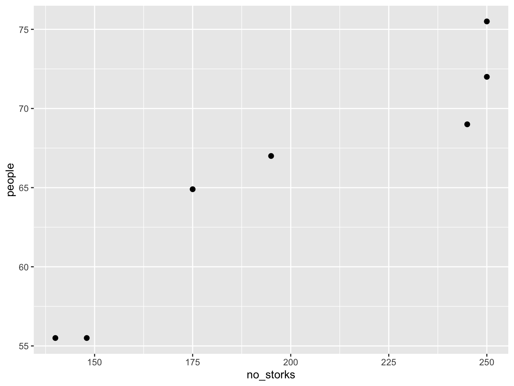
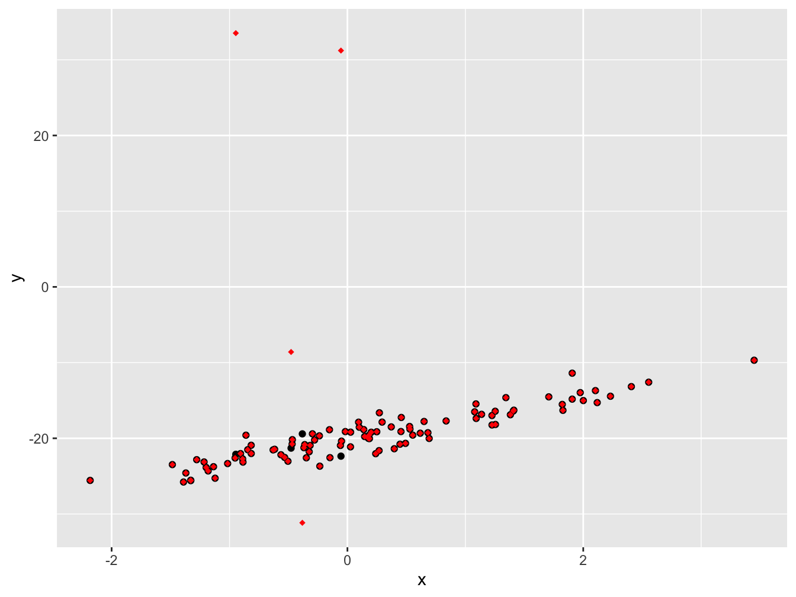
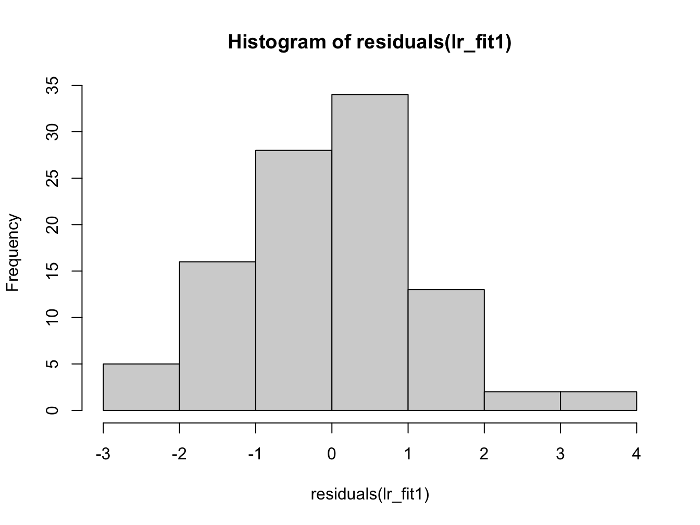
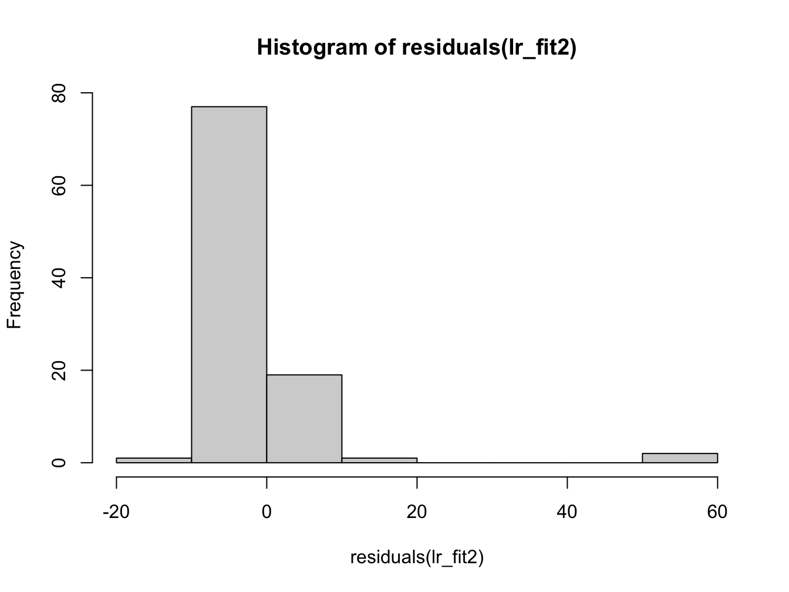

# Solutions: Linear regression and Correlation {-}

## Solution Exercise I: Correlation {- #LR-sol1}

Read in the data in `stork.txt`, compute the correlation and comment on it.

The data represents `no of storks` (column 1) in Oldenburg Germany from $1930 - 1939$ and the number of people (column 2).


```{.r .numberLines}
library(ggplot2)
library(reshape2)
```


```{.r .numberLines}
stork_dat <- read.table("stork.txt", hedaer = TRUE)
```


```{.r .numberLines}
ggplot(stork_dat, aes(x = no_storks, y = people)) +
  geom_point(size = 2)
```



This is a plot of number of people in Oldenburg (Germany) against the number of storks. We can calculate the correlation in `R`


```{.r .numberLines}
cor(stork_dat$no_storks, stork_dat$peopl)
```

```{.bg-info}
#> [1] 0.9443965
```

This is a very high correlation, and obviously there is no causation. Think about why there would be a correlation between these two random variables.

<button class="button">
[Return to Exercise](#LR-ex1)
</button>

## Solution Exercise II {- #LR-sol2}


```{.r .numberLines}
# load first data set and create data.frame
load("lr_data1.Rdata")
sim_data1 <- data.frame(x = x, y = y)

# load second data set and create data.frame
load("lr_data2.Rdata")
sim_data2 <- data.frame(x = x, y = y)

lr_fit1 <- lm(y ~ x, data = sim_data1)
lr_fit2 <- lm(y ~ x, data = sim_data2)
```

### Comparison of data


```{.r .numberLines}
ggplot(sim_data1, aes(x = x, y = y)) +
  geom_point(size = 1.5) +
  geom_point(data = sim_data2, color = "red", shape = 18)
```



If we plot the data on top of each other, the first data set in black and the second one in red, we can see a small number of points are different between the two data sets.


```{.r .numberLines}
summary(lr_fit1)
```

```{.bg-info}
#> 
#> Call:
#> lm(formula = y ~ x, data = sim_data1)
#> 
#> Residuals:
#>     Min      1Q  Median      3Q     Max 
#> -2.8309 -0.6910  0.0296  0.7559  3.3703 
#> 
#> Coefficients:
#>             Estimate Std. Error t value Pr(>|t|)    
#> (Intercept) -20.1876     0.1250 -161.46   <2e-16 ***
#> x             2.8426     0.1138   24.98   <2e-16 ***
#> ---
#> Signif. codes:  
#> 0 '***' 0.001 '**' 0.01 '*' 0.05 '.' 0.1 ' ' 1
#> 
#> Residual standard error: 1.229 on 98 degrees of freedom
#> Multiple R-squared:  0.8643,	Adjusted R-squared:  0.8629 
#> F-statistic: 624.2 on 1 and 98 DF,  p-value: < 2.2e-16
```

```{.r .numberLines}
summary(lr_fit2)
```

```{.bg-info}
#> 
#> Call:
#> lm(formula = y ~ x, data = sim_data2)
#> 
#> Residuals:
#>     Min      1Q  Median      3Q     Max 
#> -11.386  -1.960  -1.084  -0.206  54.516 
#> 
#> Coefficients:
#>             Estimate Std. Error t value Pr(>|t|)    
#> (Intercept) -18.9486     0.8006 -23.669  < 2e-16 ***
#> x             2.1620     0.7285   2.968  0.00377 ** 
#> ---
#> Signif. codes:  
#> 0 '***' 0.001 '**' 0.01 '*' 0.05 '.' 0.1 ' ' 1
#> 
#> Residual standard error: 7.87 on 98 degrees of freedom
#> Multiple R-squared:  0.08245,	Adjusted R-squared:  0.07309 
#> F-statistic: 8.806 on 1 and 98 DF,  p-value: 0.003772
```

From the summary data we can see a discrepancy between the two estimates in the regression coefficients ($\approx 1$), though the error in the estimate is quite large. The other thing to notice is that the summary of the residuals look quite different. If we investigate further and plot them we see:


```{.r .numberLines}
plot(residuals(lr_fit1))
```


```{.r .numberLines}
plot(residuals(lr_fit2))
```


Here we can once again see the outliers in the second data set which affect the estimation. We now plot the histogram and boxplots for comparison:


```{.r .numberLines}
hist(residuals(lr_fit1))
```



```{.r .numberLines}
hist(residuals(lr_fit2))
```



```{.r .numberLines}
boxplot(residuals(lr_fit2), residuals(lr_fit1))
```


Her we can see that the distribution of the residuals has significantly changed in data set 2.

A change in only 4 data points was sufficient to change the regression coefficients.

<button class="button">
[Return to Exercise](#LR-ex2)
</button>

## Solution Exercise II {- #LR-sol3}


```{.r .numberLines}
b0 <- 10 # regression coefficient for intercept
b1 <- -8 # regression coefficient for slope
sigma2 <- 0.5 # noise variance

# number of simulations for each sample size
n_simulations <- 100

# A vector of sample sizes to try
sample_size_v <- c( 5, 20, 40, 80, 100, 150, 200, 300, 500, 750, 1000 )

n_sample_size <- length(sample_size_v)

# Create a matrix to store results
mse_matrix <- matrix(0, nrow = n_simulations, ncol = n_sample_size)

# name row and column
rownames(mse_matrix) <- c(1:n_simulations)
colnames(mse_matrix) <- sample_size_v
```


```{.r .numberLines}
# loop over sample size
for (i in 1:n_sample_size) {
  N <- sample_size_v[i]

  # for each simulation
  for (it in 1:n_simulations) {

    x <- rnorm(N, mean = 0, sd = 1)
    e <- rnorm(N, mean = 0, sd = sqrt(sigma2))
    y <- b0 + b1 * x + e

    # set up a data frame and run lm()
    sim_data <- data.frame(x = x, y = y)
    lm_fit <- lm(y ~ x, data = sim_data)

    # compute the mean squared error between the fit and the actual y's
    y_hat <- fitted(lm_fit)
    mse_matrix[it, i] <- mean((y_hat - y)^2)

  }
}
```


```{.r .numberLines}
library(reshape2)

mse_df = melt(mse_matrix) # convert the matrix into a data frame for ggplot
names(mse_df) = c("Simulation", "Sample_Size", "MSE") # rename the columns

# now use a boxplot to look at the relationship between mean-squared prediction error and sample size
mse_plt = ggplot(mse_df, aes(x=Sample_Size, y=MSE))
mse_plt = mse_plt + geom_boxplot( aes(group=Sample_Size) )
print(mse_plt)
```


You should see that the variance of the mean-squared error goes down as the sample size goes up and converges towards a limiting value. Larger sample sizes help reduce the variance in our estimators but do not make the estimates more accurate.

Can you do something similar to work out the relationship between how accurate the regression coefficient estimates are as a function of sample size?

<button class="button">
[Return to Exercise](#LR-ex3)
</button>
