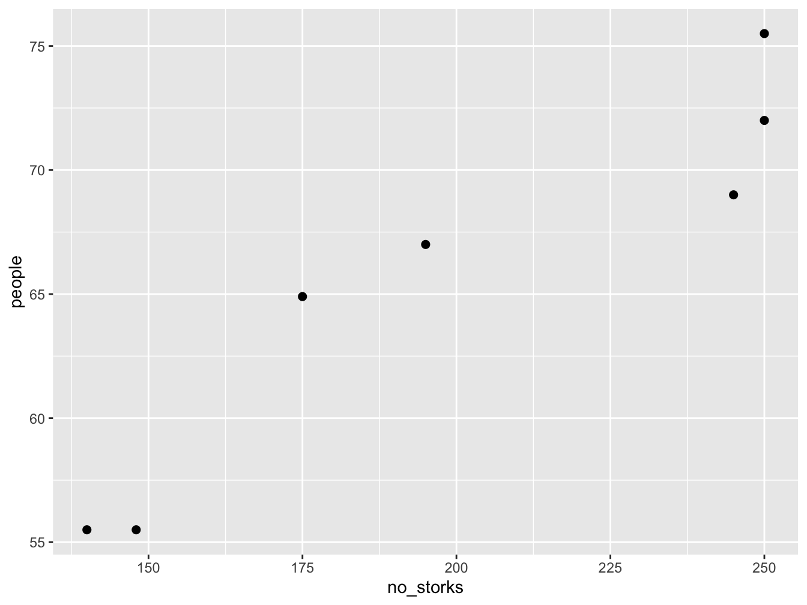
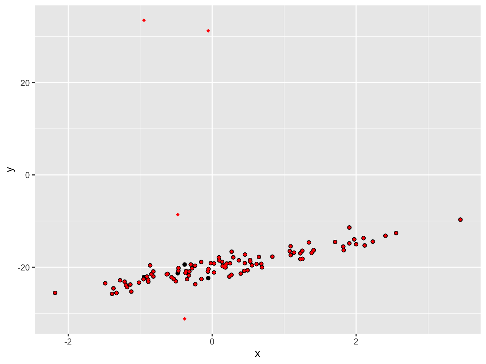
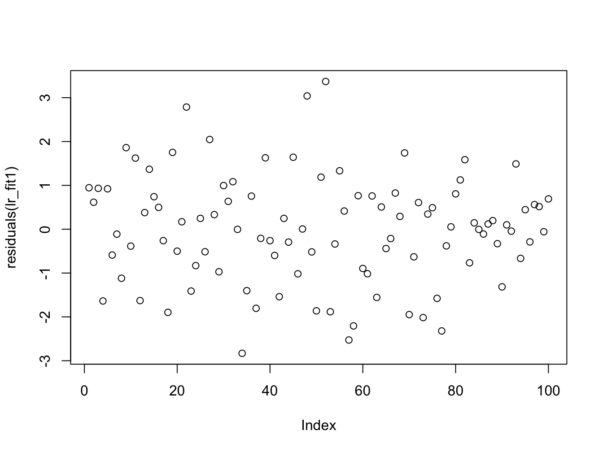
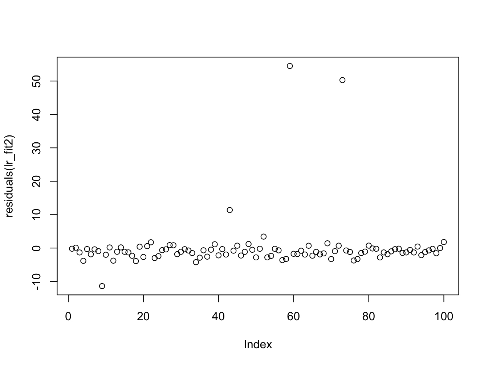
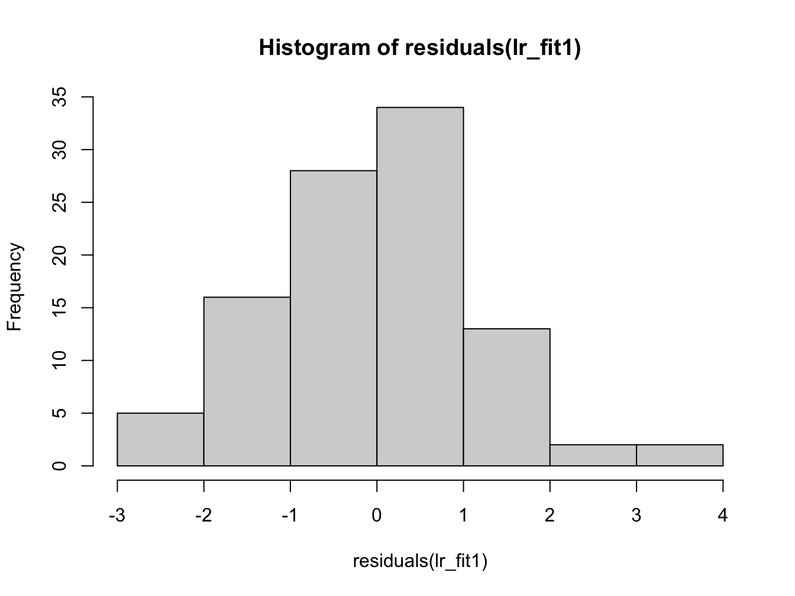
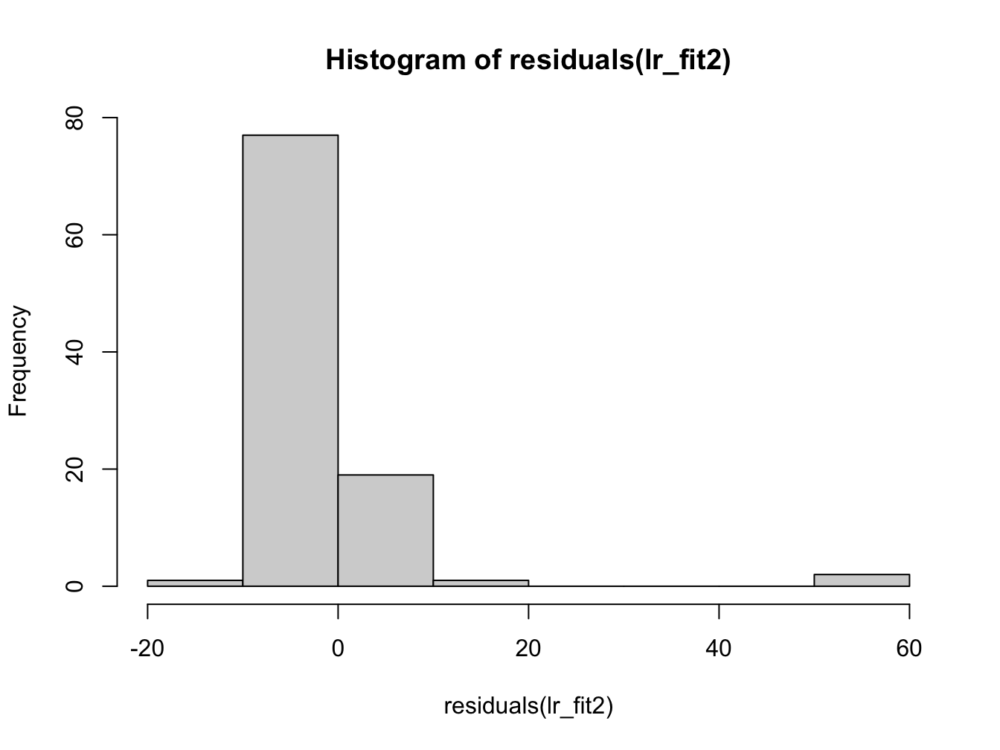
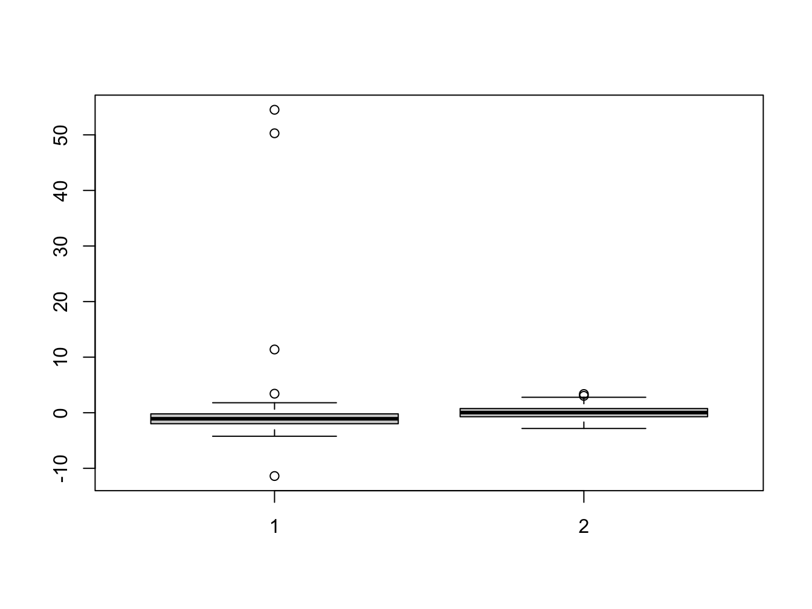
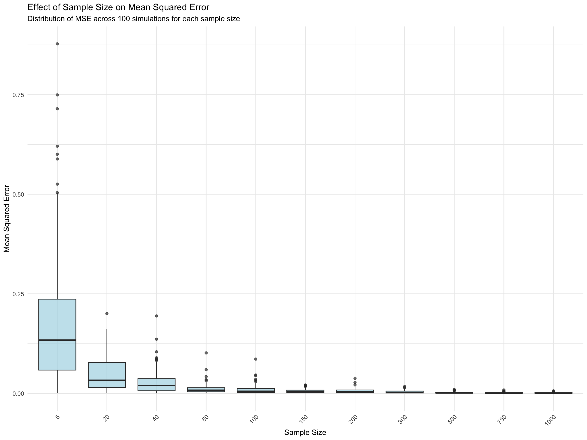

# Solution: Linear regression and Correlation

## Solution Exercise I: Linear Regression Function {- #LR-sol0}

Here's the `lr_diagnostics` function that takes a vector of responses and a vector of covariates, fits a linear regression model, and returns the required components:


```{.r .numberLines}
lr_diagnostics <- function(y, x) {
  # Input validation
  if (length(y) != length(x)) {
    stop("Error: x and y must have the same length")
  }

  if (!is.numeric(y) || !is.numeric(x)) {
    stop("Error: Both x and y must be numeric vectors")
  }

  if (length(y) < 2) {
    stop("Error: Need at least 2 observations to fit a linear model")
  }

  # Fit the linear model
  lm_model <- lm(y ~ x)

  # Extract the required components
  result <- list(
    coef = coef(lm_model),          # Estimated coefficients
    resid = residuals(lm_model),    # Residuals
    fitted = fitted(lm_model),      # Fitted values
    lm_obj = lm_model               # The lm object itself
  )

  return(result)
}
```

### Example usage:

Let's test the function with some simulated data:


```{.r .numberLines}
# Generate some example data
set.seed(123)
n <- 100
x_example <- rnorm(n, mean = 5, sd = 2)
y_example <- 2 + 3 * x_example + rnorm(n, mean = 0, sd = 1)

# Use our function
result <- lr_diagnostics(y_example, x_example)

# Display the results
cat("Coefficients:\n")
```

``` bg-info
#> Coefficients:
```

```{.r .numberLines}
print(result$coef)
```

``` bg-info
#> (Intercept)           x 
#>    2.028376    2.973764
```

```{.r .numberLines}
cat("\nFirst 10 residuals:\n")
```

``` bg-info
#> 
#> First 10 residuals:
```

```{.r .numberLines}
print(head(result$resid, 10))
```

``` bg-info
#>           1           2           3           4           5 
#> -0.63701257  0.34760898 -0.06210088 -0.24103986 -0.84203158 
#>           6           7           8           9          10 
#>  0.14776756 -0.65791640 -1.63151869 -0.31346374  0.99841506
```

```{.r .numberLines}
cat("\nFirst 10 fitted values:\n")
```

``` bg-info
#> 
#> First 10 fitted values:
```

```{.r .numberLines}
print(head(result$fitted, 10))
```

``` bg-info
#>         1         2         3         4         5         6 
#> 13.563752 15.528210 26.167659 17.316548 17.666139 27.097595 
#>         7         8         9        10 
#> 19.638509  9.373209 12.812120 14.246610
```

```{.r .numberLines}
cat("\nSummary of the linear model:\n")
```

``` bg-info
#> 
#> Summary of the linear model:
```

```{.r .numberLines}
print(summary(result$lm_obj))
```

``` bg-info
#> 
#> Call:
#> lm(formula = y ~ x)
#> 
#> Residuals:
#>     Min      1Q  Median      3Q     Max 
#> -1.9073 -0.6835 -0.0875  0.5806  3.2904 
#> 
#> Coefficients:
#>             Estimate Std. Error t value Pr(>|t|)    
#> (Intercept)  2.02838    0.29338   6.914 4.84e-10 ***
#> x            2.97376    0.05344  55.648  < 2e-16 ***
#> ---
#> Signif. codes:  
#> 0 '***' 0.001 '**' 0.01 '*' 0.05 '.' 0.1 ' ' 1
#> 
#> Residual standard error: 0.9707 on 98 degrees of freedom
#> Multiple R-squared:  0.9693,	Adjusted R-squared:  0.969 
#> F-statistic:  3097 on 1 and 98 DF,  p-value: < 2.2e-16
```

### Function Features:

1. **Input Validation**: Checks that `x` and `y` have the same length, are numeric, and have sufficient observations
2. **Linear Model Fitting**: Uses the `lm()` function to fit the regression model
3. **Comprehensive Output**: Returns all requested components in a named list:
   - `coef`: The estimated intercept and slope coefficients
   - `resid`: The residuals (observed - fitted values)
   - `fitted`: The fitted values from the model
   - `lm_obj`: The complete `lm` object for further analysis
4. **Error Handling**: Provides clear error messages for invalid inputs

This function can be easily extended to include additional diagnostics or to handle more complex model specifications.

<button class="button">
[Return to Exercise](#LR-diag-fun)
</button>

## Solution Exercise II: Correlation {- #LR-sol1}

Read in the data in `stork.txt`, compute the correlation and comment on it.

The data represents `no of storks` (column 1) in Oldenburg Germany from $1930 - 1939$ and the number of people (column 2).


```{.r .numberLines}
library(ggplot2)
library(reshape2)
```


```{.r .numberLines}
stork_dat <- read.table("stork.txt", hedaer = TRUE)
```


```{.r .numberLines}
ggplot(stork_dat, aes(x = no_storks, y = people)) +
  geom_point(size = 2)
```



This is a plot of number of people in Oldenburg (Germany) against the number of storks. We can calculate the correlation in `R`


```{.r .numberLines}
cor(stork_dat$no_storks, stork_dat$peopl)
```

``` bg-info
#> [1] 0.9443965
```

This is a very high correlation, and obviously there is no causation. Think about why there would be a correlation between these two random variables.

<button class="button">
[Return to Exercise](#LR-ex1)
</button>

## Solution Exercise III {- #LR-sol2}


```{.r .numberLines}
# load first data set and create data.frame
load("lr_data1.Rdata")
sim_data1 <- data.frame(x = x, y = y)

# load second data set and create data.frame
load("lr_data2.Rdata")
sim_data2 <- data.frame(x = x, y = y)

lr_fit1 <- lm(y ~ x, data = sim_data1)
lr_fit2 <- lm(y ~ x, data = sim_data2)
```

### Comparison of data


```{.r .numberLines}
ggplot(sim_data1, aes(x = x, y = y)) +
  geom_point(size = 1.5) +
  geom_point(data = sim_data2, color = "red", shape = 18)
```



If we plot the data on top of each other, the first data set in black and the second one in red, we can see a small number of points are different between the two data sets.


```{.r .numberLines}
summary(lr_fit1)
```

``` bg-info
#> 
#> Call:
#> lm(formula = y ~ x, data = sim_data1)
#> 
#> Residuals:
#>     Min      1Q  Median      3Q     Max 
#> -2.8309 -0.6910  0.0296  0.7559  3.3703 
#> 
#> Coefficients:
#>             Estimate Std. Error t value Pr(>|t|)    
#> (Intercept) -20.1876     0.1250 -161.46   <2e-16 ***
#> x             2.8426     0.1138   24.98   <2e-16 ***
#> ---
#> Signif. codes:  
#> 0 '***' 0.001 '**' 0.01 '*' 0.05 '.' 0.1 ' ' 1
#> 
#> Residual standard error: 1.229 on 98 degrees of freedom
#> Multiple R-squared:  0.8643,	Adjusted R-squared:  0.8629 
#> F-statistic: 624.2 on 1 and 98 DF,  p-value: < 2.2e-16
```

```{.r .numberLines}
summary(lr_fit2)
```

``` bg-info
#> 
#> Call:
#> lm(formula = y ~ x, data = sim_data2)
#> 
#> Residuals:
#>     Min      1Q  Median      3Q     Max 
#> -11.386  -1.960  -1.084  -0.206  54.516 
#> 
#> Coefficients:
#>             Estimate Std. Error t value Pr(>|t|)    
#> (Intercept) -18.9486     0.8006 -23.669  < 2e-16 ***
#> x             2.1620     0.7285   2.968  0.00377 ** 
#> ---
#> Signif. codes:  
#> 0 '***' 0.001 '**' 0.01 '*' 0.05 '.' 0.1 ' ' 1
#> 
#> Residual standard error: 7.87 on 98 degrees of freedom
#> Multiple R-squared:  0.08245,	Adjusted R-squared:  0.07309 
#> F-statistic: 8.806 on 1 and 98 DF,  p-value: 0.003772
```

From the summary data we can see a discrepancy between the two estimates in the regression coefficients ($\approx 1$), though the error in the estimate is quite large. The other thing to notice is that the summary of the residuals look quite different. If we investigate further and plot them we see:


```{.r .numberLines}
plot(residuals(lr_fit1))
```



```{.r .numberLines}
plot(residuals(lr_fit2))
```



Here we can once again see the outliers in the second data set which affect the estimation. We now plot the histogram and boxplots for comparison:


```{.r .numberLines}
hist(residuals(lr_fit1))
```



```{.r .numberLines}
hist(residuals(lr_fit2))
```



```{.r .numberLines}
boxplot(residuals(lr_fit2), residuals(lr_fit1))
```



Her we can see that the distribution of the residuals has significantly changed in data set 2.

A change in only 4 data points was sufficient to change the regression coefficients.

<button class="button">
[Return to Exercise](#LR-ex2)
</button>

## Solution Exercise III {- #LR-sol3}

In this exercise, we'll investigate how sample size affects the quality of our linear regression fit using Mean Squared Error (MSE) as our metric. We'll simulate data with known parameters and see how the variability in MSE changes with different sample sizes.

First, let's define the helper functions we'll need for our simulation:


```{.r .numberLines}
# Function to fit a simple linear model
fit_slm <- function(data) {
  return(lm(y ~ x, data = data))
}

# Function to compute mean squared error against true model
compute_mse <- function(lm_fit, b0, b1) {
  # extract the fitted values
  y_hat <- fitted(lm_fit)
  # extract the x values from the model frame
  x <- lm_fit$model$x
  # compute the true y values
  y_true <- b0 + b1 * x
  # compute and return the mean-squared error
  return(mean((y_hat - y_true)^2))
}
```

Now let's set up our simulation parameters:


```{.r .numberLines}
# Set up simulation parameters
b0 <- 10 # regression coefficient for intercept
b1 <- -8 # regression coefficient for slope
sigma2 <- 0.5 # noise variance

# number of simulations for each sample size
n_simulations <- 100

# A vector of sample sizes to try
sample_size_v <- c(5, 20, 40, 80, 100, 150, 200, 300, 500, 750, 1000)

n_sample_size <- length(sample_size_v)

# Create a matrix to store results
mse_matrix <- matrix(0, nrow = n_simulations, ncol = n_sample_size)

# name row and column
rownames(mse_matrix) <- c(1:n_simulations)
colnames(mse_matrix) <- sample_size_v
```

Now we'll run the simulation across all sample sizes:


```{.r .numberLines}
# loop over sample size
for (i in 1:n_sample_size) {
  N <- sample_size_v[i]

  # for each simulation
  for (it in 1:n_simulations) {

    x <- rnorm(N, mean = 0, sd = 1)
    e <- rnorm(N, mean = 0, sd = sqrt(sigma2))
    y <- b0 + b1 * x + e

    # set up a data frame and fit the linear model using our existing function
    sim_data <- data.frame(x = x, y = y)
    lm_fit <- fit_slm(sim_data)

    # compute the mean squared error using our existing function
    mse_matrix[it, i] <- compute_mse(lm_fit, b0, b1)

  }
}
```

Let's visualize how sample size affects the distribution of MSE values:


```{.r .numberLines}
library(reshape2)
library(ggplot2)

mse_df <- melt(mse_matrix) # convert the matrix into a data frame for ggplot
names(mse_df) = c("Simulation", "Sample_Size", "MSE") # rename the columns

# Convert Sample_Size to factor for proper ordering in plot
mse_df$Sample_Size <- factor(mse_df$Sample_Size, levels = sample_size_v)

# Create boxplot to show relationship between MSE and sample size
mse_plt <- ggplot(mse_df, aes(x = Sample_Size, y = MSE)) +
  geom_boxplot(aes(group = Sample_Size), fill = "lightblue", alpha = 0.7) +
  labs(title = "Effect of Sample Size on Mean Squared Error",
       subtitle = "Distribution of MSE across 100 simulations for each sample size",
       x = "Sample Size",
       y = "Mean Squared Error") +
  theme_minimal() +
  theme(axis.text.x = element_text(angle = 45, hjust = 1))

print(mse_plt)
```



Let's also look at summary statistics:


```{.r .numberLines}
# Calculate summary statistics for each sample size
mse_summary <- aggregate(MSE ~ Sample_Size, data = mse_df,
                        FUN = function(x) c(mean = mean(x),
                                          sd = sd(x),
                                          median = median(x)))

# Convert to a more readable format
mse_summary_df <- data.frame(
  Sample_Size = mse_summary$Sample_Size,
  Mean_MSE = mse_summary$MSE[,"mean"],
  SD_MSE = mse_summary$MSE[,"sd"],
  Median_MSE = mse_summary$MSE[,"median"]
)

print(mse_summary_df)
```

``` bg-info
#>    Sample_Size    Mean_MSE      SD_MSE   Median_MSE
#> 1            5 0.184894919 0.177110704 0.1336366103
#> 2           20 0.048610091 0.044816400 0.0328576601
#> 3           40 0.027208935 0.030564252 0.0196483190
#> 4           80 0.011367590 0.013178602 0.0078742424
#> 5          100 0.009548817 0.012027231 0.0053297869
#> 6          150 0.005534797 0.004630260 0.0046173963
#> 7          200 0.005748027 0.006341407 0.0035119165
#> 8          300 0.003813778 0.003587731 0.0026687927
#> 9          500 0.001933413 0.001869482 0.0012136973
#> 10         750 0.001353788 0.001519171 0.0007696554
#> 11        1000 0.001096210 0.001046117 0.0007440794
```

### Key Observations

From this analysis, you should observe several important patterns:

1. **Variance Reduction**: As sample size increases, the variance (spread) of the MSE decreases. This means our estimates become more **consistent** and **reliable**.

2. **Convergence**: The MSE values converge towards a limiting value as sample size increases. This limiting value represents the best achievable fit given the true underlying noise level (σ² = 0.5).

3. **Diminishing Returns**: The improvement in MSE stability is most dramatic when going from very small sample sizes (e.g., 5-20) to moderate sample sizes (e.g., 100-200). Beyond that, the gains become smaller.

4. **No Bias Reduction**: Larger sample sizes help reduce the **variance** in our estimators but do not make the estimates more **accurate** in terms of bias - the MSE doesn't systematically decrease, just becomes more consistent.

### Extension Question

Can you adapt this code to investigate how the **accuracy of the regression coefficient estimates** (β₀ and β₁) changes as a function of sample size? Hint: Instead of storing MSE, you could store the estimated coefficients and examine their bias and variance.

<button class="button">
[Return to Exercise](#LR-ex3)
</button>
