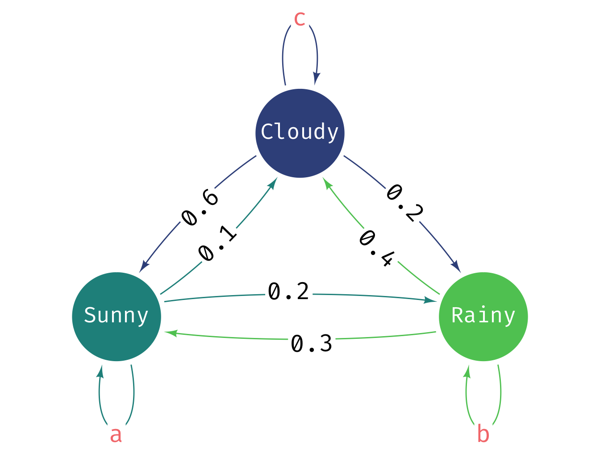

#  Solution: Markov Chains

## Three state Markov Chain {#mc-solution}

The three state Markov chain is more complex to draw. The diagram below shows the states and the transition probabilities. The self-loop probabilities need to be calculated. Let's label the edges with missing values as follows:

- Sunny -> Sunny = a
- Rainy -> Rainy = b
- Cloudy -> Cloudy = c



The next step is to set-up a transition matrix for the three-state model. The transition matrix is a square matrix where each row corresponds to a state and each column corresponds to the probability of transitioning to another state. The rows must sum to 1. The main thing to bear in mind is that the ordering of the states is arbitrary but you must be consistent. Here we will use the convention that State 1 is Sunny, State 2 is Rainy and State 3 is Cloudy.

The way we work out the values for a, b, and c is that the emission probabilities from each state must sum to 1. So we can work out the values as follows:

- For Sunny: $a + 0.2 + 0.1 = 1 \Rightarrow a = 0.7$
- For Rainy: $0.3 + b + 0.4 = 1 \Rightarrow b = 0.3$
- For Cloudy: $0.6 + 0.2 + c = 1 \Rightarrow c = 0.2$


```{.r .numberLines}
transitionMatrix = matrix(c(0.7, 0.2, 0.1,
                            0.3, 0.3, 0.4,
                            0.6, 0.2, 0.2), nrow=3, ncol=3, byrow=TRUE)

# Check matrix set-up correctly
print(transitionMatrix)
```

``` bg-info
#>      [,1] [,2] [,3]
#> [1,]  0.7  0.2  0.1
#> [2,]  0.3  0.3  0.4
#> [3,]  0.6  0.2  0.2
```

***Note:***

- Always output the matrix to check it is set up correctly.
- Check the row sums are equal to 1. If not, you have made a mistake.

Remember the ordering of the states is arbitrary but here we have used the convention that State 1 is Sunny, State 2 is Rainy and State 3 is Cloudy which means the probabilities are completed in that order in the transition matrix. We just need to be consistent.


```{.r .numberLines}
state <- 1 # initial state - it is [1] sunny, [2] rainy and [3] cloudy
weather_sequence <- rep(0, 30) # vector to store simulated values

# simulate for 30 days
for (day in 1:30) {
  pr <- transitionMatrix[state, ] # select the row of transition probabilities

  # sample [1-3] based on the probs pr
  state <- sample(c(1, 2, 3), size = 1, prob = pr)
  weather_sequence[day] <- state # store the sampled state
}
print(weather_sequence)
```

``` bg-info
#>  [1] 3 2 3 3 3 3 1 2 3 1 1 1 3 1 1 1 1 1 2 3 1 1 1 1 1 1 2 3
#> [29] 3 1
```

This is simplest way to output the weather sequence. You could also use a `data.frame` to store the day and the weather state if you wanted to output the day and the weather state together. Even better would to create plot of the weather sequence over the 30 days or perform basic statistics on the weather sequence to output a useful summary of the weather sequence. This is left as an exercise for the reader, some methods we have already covered and we will learn more over the coming days.

<button class="button">
  [Back to exercise](#mc-exercise)
</button>

## Solution: MC Function {#mc-fn-solution}

The first thing we will do when we want to write a function like this is to write the basic part of the function.


```{.r .numberLines}
# Function with just simple structure
run_markov_chain <- function(transitionMatrix, initialState, numSteps) {
  state <- initialState
  output_vec <- rep(0, numSteps) # vector to store simulated values

  return(output_vec)
}
```

This function has the basic components required, it takes three arguments and returns a vector of simulated values. Let's test if it works:


```{.r .numberLines}
# Test the function with the two-state model
transitionMatrix <- matrix(c(0.4, 0.6, 0.7, 0.3), nrow=2, ncol=2, byrow=TRUE)
initialState <- 1
numSteps <- 30
weather_sequence <- run_markov_chain(transitionMatrix, initialState, numSteps)
print(weather_sequence)
```

``` bg-info
#>  [1] 0 0 0 0 0 0 0 0 0 0 0 0 0 0 0 0 0 0 0 0 0 0 0 0 0 0 0 0
#> [29] 0 0
```

```{.r .numberLines}
print(length(weather_sequence))
```

``` bg-info
#> [1] 30
```

What we have tested here is that the function works for the two-state model and produces a vector of simulated states of the correct length. At this stage of the function that is sufficient as it doesn't do much else.

Next, we need to add the code to actually run the markov chain simulation. This is just the code we wrote above but with a few small changes to make it work in the function.


```{.r .numberLines}
# Function to run a Markov chain simulation
# input: transitionMatrix, initialState, numSteps
# output: a vector of simulated states
run_markov_chain <- function(transitionMatrix, initialState, numSteps) {
  state <- initialState
  weather_sequence <- rep(0, numSteps) # vector to store simulated values
  for (day in 1:numSteps) { # simulate for numSteps days
    pr <- transitionMatrix[state, ] # select the row of transition probabilities

    # sample [1] or [2] based on the probs pr
    state <- sample(seq_along(pr), size = 1, prob = pr)
    weather_sequence[day] <- state # store the sampled state
  }

  return(weather_sequence)
}
```

Now we have the function we need to check if the function is working as intended. The first thing to try is the two-state weather model we have already used.


```{.r .numberLines}
# Test the function with the two-state model
transitionMatrix <- matrix(c(0.4, 0.6, 0.7, 0.3), nrow=2, ncol=2, byrow=TRUE)
initialState <- 1
numSteps <- 30
weather_sequence <- run_markov_chain(transitionMatrix, initialState, numSteps)
print(weather_sequence)
```

``` bg-info
#>  [1] 1 1 2 1 2 1 1 2 1 2 2 1 1 2 1 1 2 1 2 1 2 1 2 2 1 2 1 1
#> [29] 1 2
```

```{.r .numberLines}
print(length(weather_sequence))
```

``` bg-info
#> [1] 30
```

It is always a good idea to test the function with different inputs. So next we will try the three-state weather model.


```{.r .numberLines}
# Test the function with the three-state model
transitionMatrix <- matrix(
  c(0.5, 0.3, 0.2, 0.4, 0.4, 0.2, 0.3, 0.3, 0.4), nrow=3, ncol=3, byrow=TRUE)
initialState <- 1
numSteps <- 30
weather_sequence <- run_markov_chain(transitionMatrix, initialState, numSteps)
print(weather_sequence)
```

``` bg-info
#>  [1] 1 2 2 2 1 1 3 2 1 2 2 2 3 2 1 2 1 3 3 1 1 1 2 3 2 1 1 1
#> [29] 1 2
```

```{.r .numberLines}
print(length(weather_sequence))
```

``` bg-info
#> [1] 30
```

This works as expected and produces a vector of simulated states for the three-state model. We can further change the initial state, for 50 states and analyze the output or visualize it as needed.


```{.r .numberLines}
# Test the function with a 50-state model
transitionMatrix <- matrix(runif(2500), nrow=50, ncol=50)
transitionMatrix <- transitionMatrix / rowSums(transitionMatrix) # normalize rows
initialState <- 1
numSteps <- 30
weather_sequence <- run_markov_chain(transitionMatrix, initialState, numSteps)
print(weather_sequence)
```

``` bg-info
#>  [1] 43 33  5  4 23 46 45 36 19  2 30  4 20 29 13 44 45 28
#> [19] 46 45 44 16 13 29 24  9  3 43  5 42
```

```{.r .numberLines}
print(length(weather_sequence))
```

``` bg-info
#> [1] 30
```

<button class="button">
  [Back to exercise](#mc-function)
</button>
