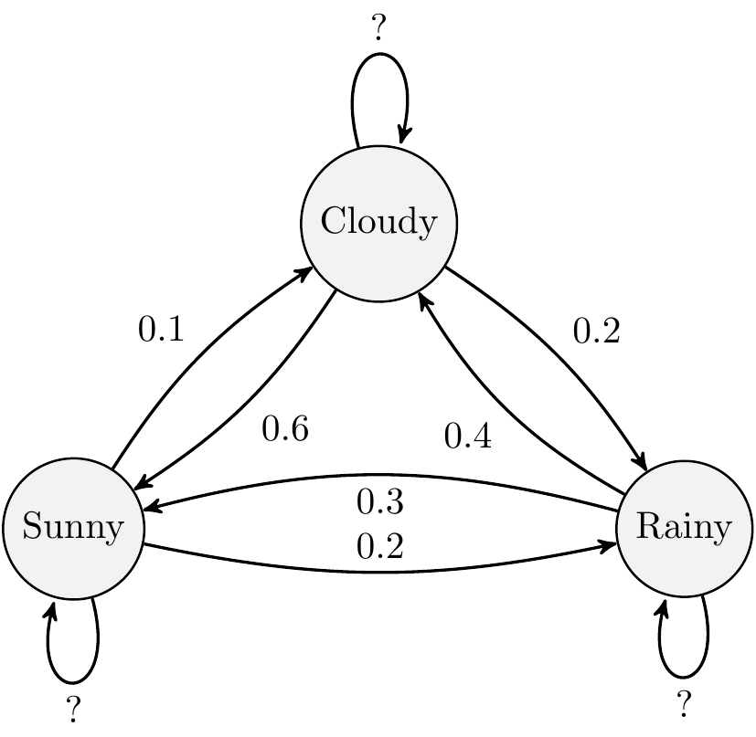

#  Solution: Three state Markov Chain {#mc-solution}


Set up a 3x3 transition matrix:


```{.r .numberLines}
transitionMatrix = matrix(c(0.7, 0.2, 0.1,
                            0.3, 0.3, 0.4,
                            0.6, 0.2, 0.2), nrow=3, ncol=3, byrow=TRUE)

# Check matrix set-up correctly
print(transitionMatrix)
```

``` bg-info
#>      [,1] [,2] [,3]
#> [1,]  0.7  0.2  0.1
#> [2,]  0.3  0.3  0.4
#> [3,]  0.6  0.2  0.2
```

***Note:***

- Always output the matrix to check it is set up correctly.
- Check the row sums are equal to 1. If not, you have made a mistake.

Remember the ordering of the states is arbitrary but here we have used the convention that State 1 is Sunny, State 2 is Rainy and State 3 is Cloudy which means the probabilities are completed in that order in the transition matrix. We just need to be consistent.


```{.r .numberLines}
state <- 1 # initial state - it is [1] sunny, [2] rainy and [3] cloudy
weather_sequence <- rep(0, 30) # vector to store simulated values

# simulate for 30 days
for (day in 1:30) {
  pr <- transitionMatrix[state, ] # select the row of transition probabilities

  # sample [1-3] based on the probs pr
  state <- sample(c(1, 2, 3), size = 1, prob = pr)
  weather_sequence[day] <- state # store the sampled state
}
print(weather_sequence)
```

``` bg-info
#>  [1] 1 1 1 1 1 1 1 1 2 1 1 3 2 2 1 1 1 1 1 2 3 2 3 1 1 1 1 1
#> [29] 2 2
```

This is simplest way to output the weather sequence. You could also use a `data.frame` to store the day and the weather state if you wanted to output the day and the weather state together. Even better would to create plot of the weather sequence over the 30 days or perform basic statistics on the weather sequence to output a useful summary of the weather sequence. This is left as an exercise for the reader, some methods we have already covered and we will learn more over the coming days.

<button class="button">
  [Back to exercise](#mc-exercise)
</button>
