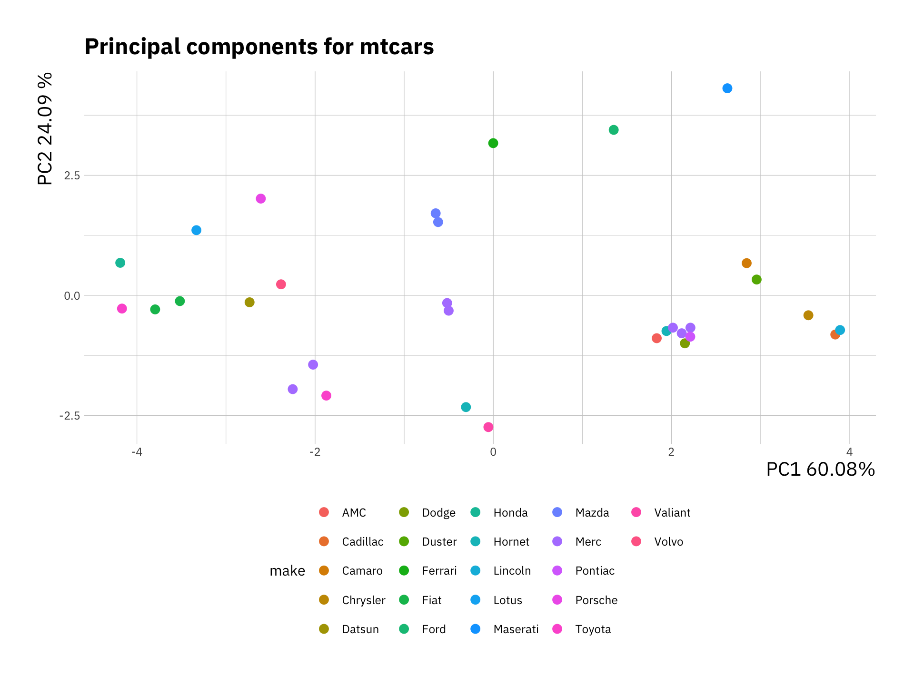
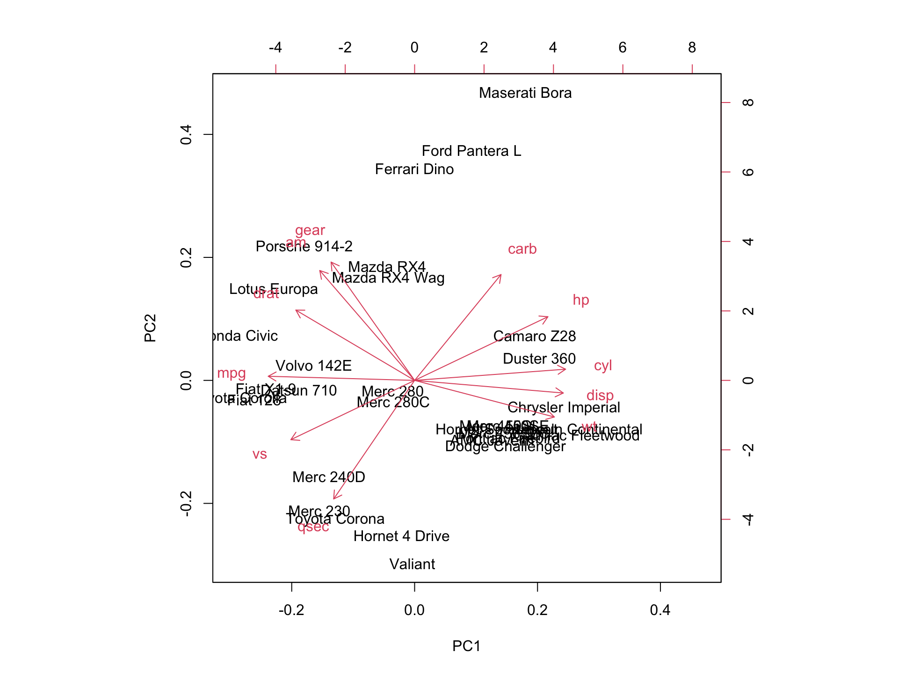
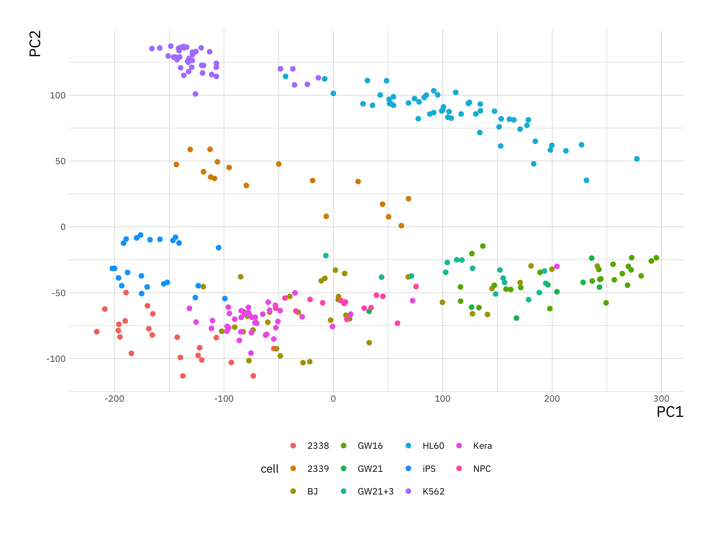

# Principal component analysis

In this practical we will practice some of the ideas outlined in the lecture on Principal Component Analysis (PCA), this will include computing principal components, visualisation techniques and an application to real data.

## Data

For this practical you will require three datasets, for more information about downloading data see the link below:

<button class="buttonD">
  [Download data](#data-pca)
</button>

## Introduction

We use PCA in order to explore complex datasets. By performing dimensionality reduction we can better visualize the data that has many variables. This technique is probably the most popular tool applied across bioscience problems (e.g. for gene expression problems).

In many real-world dataset we deal with a high dimensional data, e.g. for a number of individuals we can take a number of health related measurement (called variables). This is great, however having a large number of variables also means that it is difficult to plot the data as it is (in its "*raw*" format), and in turn it might be difficult to understand if this dataset contains any interesting patterns/trends/relationships across individuals. Using PCA we visualize such data in a more "*human friendly*" fashion.

Recall:

- PCA performs a linear transformation to data.
- This means that any input data can be visualized in a new coordinate system. The first coordinate (PC 1) variance is found on the first coordinate; each subsequent coordinate is orthogonal to the previous one and contains the larges variance from what was left.
- Each principal component is associated with certain percentage of the total variation in the dataset.
- If variables are strongly correlated with one another, a first few principal components will enable us to visualize the relationships present in any dataset.
- Eigenvectors describe new directions, whereas accompanying eigenvalues tell us how much variance there is in the data in given direction.
- The eigenvector with the highest eigenvalue is called the first principal component. The second highest eigenvalue would correspond to a second principle component and etc.
- There exist a $d$ number of eigenvalues and eigenvectors; $d$ is also equal to the size of the data (number of dimensions).
- For the purpose of visualization we preselect the first $q$ components, where $q < d$.

## Example: PCA on the `mtcars` dataset

There are many datasets built into `R`. Wed will look at the `mtcars` dataset. Type `?mtcars` to get a description of data. Then use `head()` function to have a look at the first few rows; and `dim()` to get the dimensions of the data.


```{.r .numberLines}
library(ggplot2)
head(mtcars)
```

``` bg-info
#>                    mpg cyl disp  hp drat    wt  qsec vs am
#> Mazda RX4         21.0   6  160 110 3.90 2.620 16.46  0  1
#> Mazda RX4 Wag     21.0   6  160 110 3.90 2.875 17.02  0  1
#> Datsun 710        22.8   4  108  93 3.85 2.320 18.61  1  1
#> Hornet 4 Drive    21.4   6  258 110 3.08 3.215 19.44  1  0
#> Hornet Sportabout 18.7   8  360 175 3.15 3.440 17.02  0  0
#> Valiant           18.1   6  225 105 2.76 3.460 20.22  1  0
#>                   gear carb
#> Mazda RX4            4    4
#> Mazda RX4 Wag        4    4
#> Datsun 710           4    1
#> Hornet 4 Drive       3    1
#> Hornet Sportabout    3    2
#> Valiant              3    1
```

```{.r .numberLines}
dim(mtcars)
```

``` bg-info
#> [1] 32 11
```


In this case we have $32$ examples (cars in this case), and $11$ features.
Now we can perform a principal component analysis, in `R` it is implemented as the `prcomp()` function. We can type `?prcomp` to see a description of the function and some help on possible arguments. Here we set `center` and `scale` arguments to `TRUE`, recall from the lecture why this is important. We can try to perform PCA without scaling and centering and compare.


```{.r .numberLines}
cars_pca <- prcomp(mtcars, center = TRUE, scale = TRUE)
```

We can use the `summary()` function to summarise the results from PCA, it will return the standard deviation, the proportion of variance explained by each principal component, and the cumulative proportion.


```{.r .numberLines}
pca_summary <- summary(cars_pca)
print(pca_summary)
```

``` bg-info
#> Importance of components:
#>                           PC1    PC2     PC3     PC4
#> Standard deviation     2.5707 1.6280 0.79196 0.51923
#> Proportion of Variance 0.6008 0.2409 0.05702 0.02451
#> Cumulative Proportion  0.6008 0.8417 0.89873 0.92324
#>                            PC5     PC6    PC7     PC8
#> Standard deviation     0.47271 0.46000 0.3678 0.35057
#> Proportion of Variance 0.02031 0.01924 0.0123 0.01117
#> Cumulative Proportion  0.94356 0.96279 0.9751 0.98626
#>                           PC9    PC10   PC11
#> Standard deviation     0.2776 0.22811 0.1485
#> Proportion of Variance 0.0070 0.00473 0.0020
#> Cumulative Proportion  0.9933 0.99800 1.0000
```

*Note,* `Proportion of Variance` will always add up to $1$ if you include all principal components. Here the `PC1` explain $60.08%$ of the variance, and `PC2` explains $24.09%$, which means together `PC1` and `PC2` account for $84.17%$  of the variance.

Using the `str()` function we can see the full structure of an `R` object, or alternatively using `?prcomp` in the *Value* section. In this case the `cars_pca` variable is a list containing several variables, `x` is the data represented using the new principal components. We can now plot the data in the first two principal components:


```{.r .numberLines}
pca_df <- data.frame(cars_pca$x, make = stringr::word(rownames(mtcars), 1))

ggplot(pca_df, aes(x = PC1, y = PC2, col = make)) +
geom_point(size = 3) +
labs(x = "PC1 60.08%",
     y = "PC2 24.09 %",
     title = "Principal components for mtcars") +
theme(legend.position = "bottom")
```



Here we added a color based on the make of each car. We can observe which samples (or cars) cluster together. Have a look at these variables and decide why certain cars or models would cluster together.

We created this plot using the `ggplot2` package, it is also possible to do this using base plot if you prefer.


```{.r .numberLines}
plot(pca_df$PC1, pca_df$PC2)
```


## Creating plots for PCA

Next we look at another representation of the data, the *biplot*. This is a combination of a PCA plot of the data and a *score plot*. We saw the PCA plot in the previous section in a *biplot* we add the original axis as arrows.


```{.r .numberLines}
biplot(cars_pca)
```



We can see the original axis starting from the origin. Therefore we can make observations about the original variables (e.g. `cyl` and `mpg` contribute to PC1) and how the data points relates to these axes.


::: {.infobox}
## Exercise I

Now try to perform a PCA on the `USArrests` data also build into `R`. Typing `?USArrests` will give you further information on the data. Perform the analysis on the subset `USArrests[, -3]` data.

<font style="color:darkorange">
Discuss with your neighbour and the instructor what you observe in the plot. What do you think the first two principal components represent in this case?
</font>
:::

## Example: Single cell data

We can now try to apply what we learned above on a more realistic datasets. You can download the data either on *canvas* or using these links [`Pollen2014.txt`](https://raw.github.com/anasrana/module1-practical_Bham/master/data/Pollen2014.txt) and [`SupplementaryLabels.txt`](https://raw.github.com/anasrana/module1-practical_Bham/master/data/SupplementaryLabels.txt). Her we will be dealing with single cell RNA-Seq (scRNA-Seq) data, which consist of $300$ single cells measured across $8686$ genes.


```{.r .numberLines}
pollen_df <-read.table("Pollen2014.txt", sep=',', header = T,row.names=1)

label_df <-read.table("SupplementaryLabels.txt", sep=',', header = T)

pollen_df[1:10, 1:6]
```

``` bg-info
#>          Cell_2338_1 Cell_2338_10 Cell_2338_11 Cell_2338_12
#> MTND2P28          78          559          811          705
#> MTATP6P1        2053         1958         4922         4409
#> NOC2L              1          125          126            0
#> ISG15           2953         4938          580          523
#> CPSF3L             2           42           19            0
#> MXRA8              0            0            0            0
#> AURKAIP1         302          132           64          492
#> CCNL2              0          235            0           84
#> MRPL20           330          477          288          222
#> SSU72            604          869         2046          158
#>          Cell_2338_13 Cell_2338_14
#> MTND2P28          384          447
#> MTATP6P1         2610         3709
#> NOC2L             487           66
#> ISG15            2609            1
#> CPSF3L             37           12
#> MXRA8               0            0
#> AURKAIP1           11          182
#> CCNL2              13           11
#> MRPL20             44          282
#> SSU72             530          272
```

```{.r .numberLines}
dim(pollen_df)
```

``` bg-info
#> [1] 8686  300
```

Measurements of scRNA-Seq data are integer counts, this data does not have good properties so we perform a transformation on the data. The most commonly used transformation on RNA-Seq count data is $\log_2$. We will also transpose the data matrix to rows representing cells and columns representing genes. This is the data we can use to perform PCA.


```{.r .numberLines}
# scRNA-Seq data transformation
pollen_mat <- log2(as.matrix(pollen_df) + 1)
# transpose the data
pollen_mat <- t(pollen_mat)
```

We will now use information that we read into the `label_df` variable to rename cells.


```{.r .numberLines}
# Check which columns we have available
colnames(label_df)
```

``` bg-info
#> [1] "Cell_Identifier"        "Population"            
#> [3] "Cell_names"             "TrueLabel_CellLevel"   
#> [5] "Tissue_name"            "TrueLabel_TissuelLevel"
```

```{.r .numberLines}
# rename rows
rownames(pollen_mat) <- label_df$Cell_names
```

Next we perform PCA on the data and extract the proportion of variance explained by each component.


```{.r .numberLines}
sc_pca <- prcomp(pollen_mat)

# variance is the square of the standard deviation
pr_var <- sc_pca$sdev^2

# compute the variance explained by each principal component
prop_var_exp <- pr_var / sum(pr_var)
```

Think about the calculation and what exactly it means. We can visualise this


```{.r .numberLines}
var_exp <- data.frame(variance = prop_var_exp, pc = 1:length(prop_var_exp))

ggplot(var_exp[1:30, ], aes(x = pc, y = variance)) +
    geom_bar(stat = "identity") +
    labs(x = "Principal Component",
         y  = "Variance explained")
```


We see that the first few principal components explain significant variance, but after about the PC10, there is very limited contribution. Next we will plot the data using the first two Principal components as before.


```{.r .numberLines}
sc_pca_df <- data.frame(sc_pca$x, cell = rownames(sc_pca$x),
                        var_exp = prop_var_exp)

ggplot(sc_pca_df, aes(x = PC1, y = PC2, col = cell)) +
    geom_point(size = 2) +
    theme(legend.position = "bottom")
```



Why is it not useful to create biplot for this example?

*Hint: try plotting one to see*
