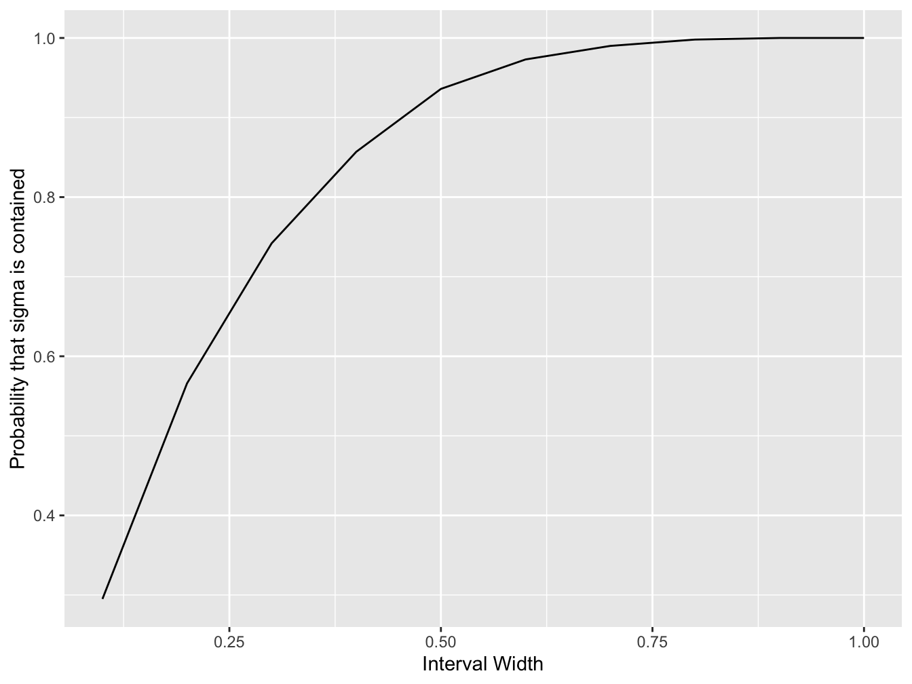

# Solution: Confidence Interval {#sol-ex-CI}

> Can you devise a way to compute a confidence interval for the population standard deviation?

You can make use of the following as a point estimate of the sample variance:

\[
  s^2 = \frac{1}{n - 1}\sum_{i = 1}^n (x - \bar{x})^2
\]

which can be calculated using the `sd` function in `R`, remember the relationship between the standard deviation and variance.


```{.r .numberLines}
## Define some parameters
# number of data points to generate
n <- 30
# population mean
mu <- 2.5
# population standard deviation (square root of population variance)
sigma <- 1.0
nreps <- 1000 # number of Monte Carlo simulation runs
# define a series of interval widths
interval_width <- seq(0.1, 1.0, 0.1)
# store the number of interval widths generated
n_interval_widths <- length(interval_width)

# create a vector to store the number of times
# the population variance is contained
sigma_contained <- rep(0, n_interval_widths)

for (replicate in 1:nreps) {

  x <- rnorm(n, mean = mu, sd = sigma) # simulate a data set

  sigmabar <- sd(x) # compute the sample standard deviation

  # for each interval width that we are testing ...
  for (j in 1:n_interval_widths) {
    # check if the interval contains the true mean
    if ((sigma > sigmabar - 0.5 * interval_width[j]) &
        (sigma < sigmabar + 0.5 * interval_width[j])) {

      # if it is, we increment the count by one for this width
      sigma_contained[j] <- sigma_contained[j] + 1
    }
  }
}

probability_var_contained <- sigma_contained / nreps

# create a data frame containing the variables we wish to plot
df <- data.frame(interval_width = interval_width,
        probability_var_contained = probability_var_contained)

# initialise the ggplot
plt <- ggplot(df, aes(x = interval_width, y = probability_var_contained))
# create a line plot
plt <- plt + geom_line()
# add a horizontal axis label
plt <- plt + xlab("Interval Width")
# create a vertical axis label
plt <- plt + ylab("Probability that sigma is contained")

# plot to screen
print(plt)
```



```{.r .numberLines}
print(df)
```

``` bg-info
#>    interval_width probability_var_contained
#> 1             0.1                     0.295
#> 2             0.2                     0.566
#> 3             0.3                     0.742
#> 4             0.4                     0.857
#> 5             0.5                     0.936
#> 6             0.6                     0.973
#> 7             0.7                     0.990
#> 8             0.8                     0.998
#> 9             0.9                     1.000
#> 10            1.0                     1.000
```

<button class="button">
  [Return to Exercise](#ex-confidence-interval)
</button>
