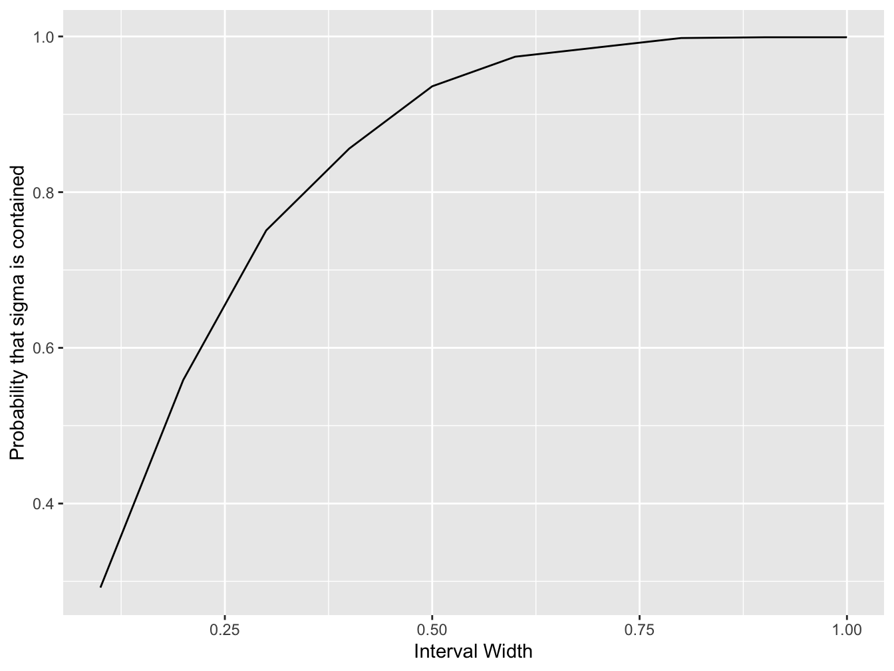
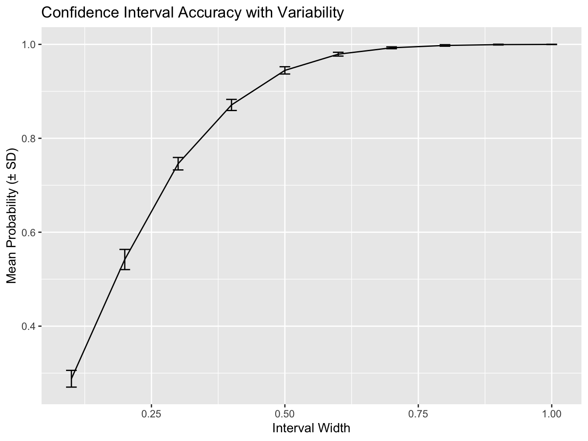

# Solution: Confidence Interval {#sol-ex-CI}

> Can you devise a way to compute a confidence interval for the population standard deviation?

You can make use of the following as a point estimate of the sample variance:

\[
  s^2 = \frac{1}{n - 1}\sum_{i = 1}^n (x - \bar{x})^2
\]

which can be calculated using the `sd` function in `R`, remember the relationship between the standard deviation and variance.


## Function Definitions

First, let's define the functions that will be used for the confidence interval analysis:


```{.r .numberLines}
# Function to simulate confidence intervals for standard deviation
simulate_confidence_intervals <- function(
    sample_size, n_repeats, interval_widths, population_mean = 2.5,
    population_sd = 1.0) {

  # Initialize storage for results
  n_interval_widths <- length(interval_widths)
  sigma_contained <- rep(0, n_interval_widths)

  # Run Monte Carlo simulations
  for (replicate in 1:n_repeats) {
    # Generate sample data
    x <- rnorm(sample_size, mean = population_mean, sd = population_sd)

    # Compute sample standard deviation
    sample_sd <- sd(x)

    # Test each interval width
    for (j in 1:n_interval_widths) {
      # Check if interval contains the true standard deviation
      lower_bound <- sample_sd - 0.5 * interval_widths[j]
      upper_bound <- sample_sd + 0.5 * interval_widths[j]

      if ((population_sd > lower_bound) && (population_sd < upper_bound)) {
        sigma_contained[j] <- sigma_contained[j] + 1
      }
    }
  }

  # Calculate probabilities
  probabilities <- sigma_contained / n_repeats

  return(list(
    interval_widths = interval_widths,
    probabilities = probabilities,
    counts = sigma_contained
  ))
}

# Function to analyze confidence interval accuracy with multiple runs
analyze_ci_accuracy <- function(sample_size, n_repeats, interval_widths,
                               n_runs = 10, population_mean = 2.5, population_sd = 1.0) {

  # Storage for results from multiple runs
  all_probabilities <- matrix(0, nrow = n_runs, ncol = length(interval_widths))

  # Run the simulation multiple times to assess variability
  for (run in 1:n_runs) {
    result <- simulate_confidence_intervals(sample_size, n_repeats, interval_widths,
                                          population_mean, population_sd)
    all_probabilities[run, ] <- result$probabilities
  }

  # Calculate mean and standard deviation for each interval width
  mean_accuracy <- colMeans(all_probabilities)
  sd_accuracy <- apply(all_probabilities, 2, sd)

  return(list(
    interval_widths = interval_widths,
    mean_accuracy = mean_accuracy,
    sd_accuracy = sd_accuracy,
    all_probabilities = all_probabilities
  ))
}
```

## Main Analysis

Now we'll use these functions to perform the confidence interval analysis:


```{.r .numberLines}
## Define parameters
n <- 30                              # sample size
mu <- 2.5                           # population mean
sigma <- 1.0                        # population standard deviation
nreps <- 1000                       # number of Monte Carlo simulation runs
interval_width <- seq(0.1, 1.0, 0.1) # interval widths to test

# Run the simulation
results <- simulate_confidence_intervals(
  sample_size = n,
  n_repeats = nreps,
  interval_widths = interval_width,
  population_mean = mu,
  population_sd = sigma
)

probability_var_contained <- results$probabilities

# create a data frame containing the variables we wish to plot
df <- data.frame(interval_width = results$interval_widths,
        probability_var_contained = probability_var_contained)

# initialise the ggplot
plt <- ggplot(df, aes(x = interval_width, y = probability_var_contained))
# create a line plot
plt <- plt + geom_line()
# add a horizontal axis label
plt <- plt + xlab("Interval Width")
# create a vertical axis label
plt <- plt + ylab("Probability that sigma is contained")

# plot to screen
print(plt)
```



```{.r .numberLines}
print(df)
```

``` bg-info
#>    interval_width probability_var_contained
#> 1             0.1                     0.312
#> 2             0.2                     0.551
#> 3             0.3                     0.723
#> 4             0.4                     0.851
#> 5             0.5                     0.928
#> 6             0.6                     0.969
#> 7             0.7                     0.993
#> 8             0.8                     1.000
#> 9             0.9                     1.000
#> 10            1.0                     1.000
```

## Advanced Analysis with Accuracy Assessment

Let's also analyze the variability in our confidence interval estimates:


```{.r .numberLines}
# Analyze accuracy with multiple runs
accuracy_results <- analyze_ci_accuracy(
  sample_size = n,
  n_repeats = nreps,
  interval_widths = interval_width,
  n_runs = 10,
  population_mean = mu,
  population_sd = sigma
)

# Create summary table
summary_df <- data.frame(
  interval_width = accuracy_results$interval_widths,
  mean_accuracy = accuracy_results$mean_accuracy,
  sd_accuracy = accuracy_results$sd_accuracy
)

print("Summary of Confidence Interval Accuracy:")
```

``` bg-info
#> [1] "Summary of Confidence Interval Accuracy:"
```

```{.r .numberLines}
print(summary_df)
```

``` bg-info
#>    interval_width mean_accuracy  sd_accuracy
#> 1             0.1        0.2993 0.0153915561
#> 2             0.2        0.5484 0.0160291401
#> 3             0.3        0.7406 0.0087075957
#> 4             0.4        0.8718 0.0091627264
#> 5             0.5        0.9444 0.0067692113
#> 6             0.6        0.9770 0.0054569018
#> 7             0.7        0.9920 0.0027080128
#> 8             0.8        0.9979 0.0017919573
#> 9             0.9        0.9991 0.0012866839
#> 10            1.0        0.9999 0.0003162278
```

```{.r .numberLines}
# Plot mean accuracy with error bars
plt_accuracy <- ggplot(summary_df, aes(x = interval_width, y = mean_accuracy))
plt_accuracy <- plt_accuracy + geom_line()
plt_accuracy <- plt_accuracy + geom_errorbar(aes(ymin = mean_accuracy - sd_accuracy,
                                               ymax = mean_accuracy + sd_accuracy),
                                           width = 0.02)
plt_accuracy <- plt_accuracy + xlab("Interval Width")
plt_accuracy <- plt_accuracy + ylab("Mean Probability (± SD)")
plt_accuracy <- plt_accuracy + ggtitle("Confidence Interval Accuracy with Variability")

print(plt_accuracy)
```


```

<button class="button">
  [Return to Exercise](#ex-confidence-interval)
</button>
