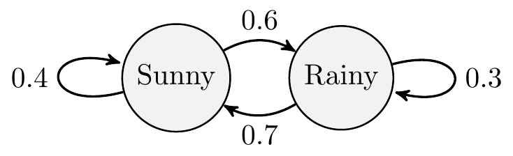

# Markov Chains

<!-- In this practical you will learn a number of techniques in R that you will use to simulate simplified games of Monopoly (<https://en.wikipedia.org/wiki/Monopoly_(game)>). In addition, there are also many tutorials and guides on the Web describing how to produce computer simulations for Monopoly. You are welcome to read and use these examples to inspire your work. -->

We will now look at a **Markov Chain**. We have not covered it during lectures but based on the basic principles we have covered we will be able to use it for simulations.

Any random process is known to have the *Markov property* (a Markov process) if the probability of going to the next state depends only on the current state and not on the past states. A Markov process is **memoryless property** in that it does not store any property or memory of its past states.

If a Markov process operates within a specific (finite) set of states, it is called a ***Markov Chain***.

A Markov Chain is defined by three properties:

1.  A state space: a set of values or states in which a process could exist

2.  A transition matrix: defines the probability of moving from one state to another state

3.  A current state probability distribution: defines the probability of being in any one of the states at the start of the process

Consider the following example where we have two states describing the weather on any particular day: (i) Sunny and (ii) Rainy. Each arrow denotes the probability of going from one state to itself or another over the course of a day. For example, if it is currently sunny, the probability of it raining the next day is 0.6. Conversely, if it is raining, the probability that it will become sunny the next day is 0.7 and 0.3 that it will continue raining.



The transition matrix can be written as the following in R:


```{.r .numberLines}
transitionMatrix = matrix(c(0.4, 0.6, 0.7, 0.3), nrow=2, ncol=2, byrow=TRUE)
print(transitionMatrix)
```

``` bg-info
#>      [,1] [,2]
#> [1,]  0.4  0.6
#> [2,]  0.7  0.3
```

which creates a 2 x 2 matrix consisting of the transition probabilities shown in the diagram.

Suppose I want to simulate a sequence of 30 days and the weather patterns over those days. Assuming that on day 0 it is currently sunny, I can do the following:


```{.r .numberLines}
# initial state - it is [1] sunny or [2] rainy
state <- 1
weather_sequence <- rep(0, 30) # vector to store simulated values
for (day in 1:30) { # simulate for 30 days
  pr <- transitionMatrix[state, ] # select the row of transition probabilities

  # sample [1] or [2] based on the probs pr
  state = sample(c(1, 2), size = 1, prob = pr)
  weather_sequence[day] <- state # store the sampled state
}

# print the simulated weather sequence
print(weather_sequence)
```

``` bg-info
#>  [1] 2 1 1 1 2 1 2 1 2 2 2 1 1 2 2 1 1 2 2 2 1 2 1 2 1 1 2 1
#> [29] 1 2
```

::: {.infobox}
## Exercise MC

> Can you extend this example to a three-state model?


Note, the diagram (intentionally) misses out the self-transitions. You should be able to infer this because the probabilities given would otherwise not add up to one!

<button class="button">
  [Show Solution](#mc-solution)
</button>


:::
