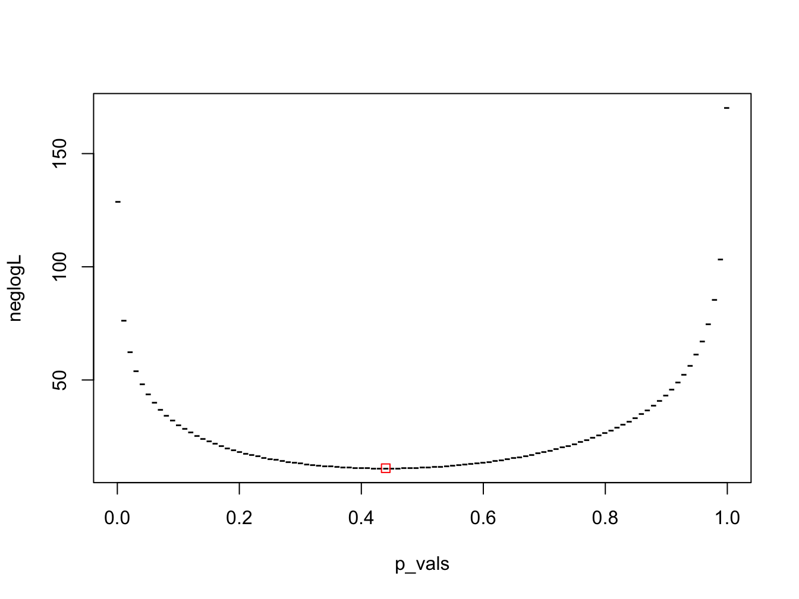

# Solution: Model Answers: MLE {#sol-mle}

A potentially biased coin is tossed 10 times and the number of heads recorded. The experiment is repeated 5 times and the number of heads recorded was 3, 2, 4, 5 and 2 respectively.

We need to choose the correct pdf and then write a likelihood function in `R`. In this case, we will use the binomial distribution. In this case, this is one of the ways we write the solution.


```{.r .numberLines}
neglogLikelihood <- function(p, n, x) {
  # compute density for each data element in x
  logF <- dbinom(x, n, prob = c(p, 1 - p), log = TRUE)
  return(-sum(logF)) # return negative log-likelihood
}

n <- 10 # number of coin tosses
x <- c(3, 2, 4, 5, 2) # number of heads observed

p_init <- 0.5 # initial value of the probability

# run optim to get maximum likelihood estimates
out <- optim(p_init, neglogLikelihood, gr = NULL, n, x, method = "L-BFGS-B",
  lower = 0.001, upper = 1-0.001)

# create a grid of probability values
p_vals <- seq(0.001, 1 - 0.001, length = 101)

# use apply to compute the negative log-likelihood for each probability value
neglogL <- apply(matrix(p_vals), 1, neglogLikelihood, n, x)

# plot negative log-likelihood function and overlay maximum (negative)
# log-likelihood estimate
plot(p_vals, neglogL, pch = "-")
points(out$par, out$value, col = "red", pch = 0)
```



<button class="button">
[Back to exercise](#ex-mle)
</button>
