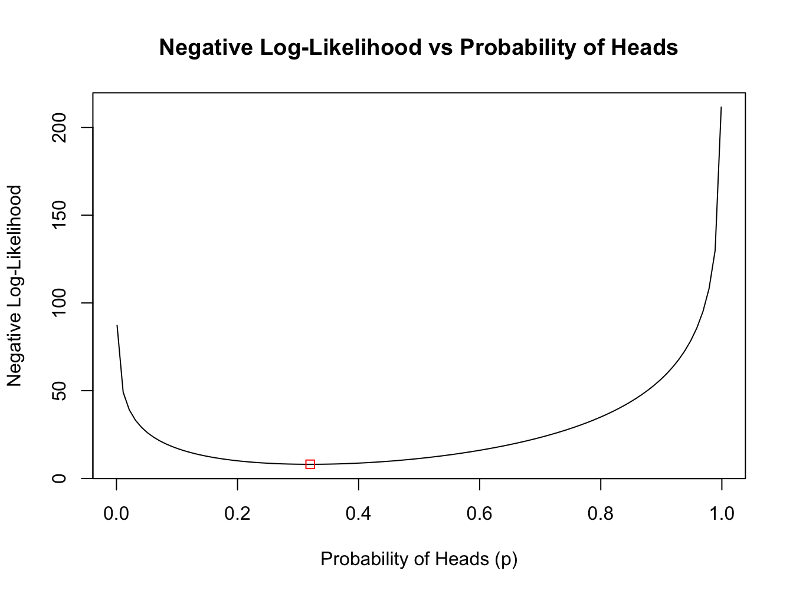

# Solution: Model Answers: MLE {#sol-mle}

A potentially biased coin is tossed 10 times and the number of heads recorded. The experiment is repeated 5 times and the number of heads recorded was 3, 2, 4, 5 and 2 respectively.

We need to choose the correct pdf and then write a likelihood function in `R`. In this case, we will use the binomial distribution. In this case, this is one of the ways we write the solution.

Let us first write the function to compute the negative log-likelihood and then a function to compute the negative log-likelihood for a grid of probability values.


```{.r .numberLines}
neglogLikelihood <- function(p, n, x) {
  # compute density for each data element in x
  logF <- dbinom(x, n, prob = p, log = TRUE)
  return(-sum(logF)) # return negative log-likelihood
}


# Function that runs optim and outputs negative log likelihood
run_optim_mle <- function(p_vals, n, x, method = "L-BFGS-B",
                          lower = 0.001, upper = 0.999) {
  # Storage for results
  results <- list()

  # Run optim for each starting value in p_vals
  for (i in seq_along(p_vals)) {
    p_init <- p_vals[i]

    # Run optimization
    optim_result <- optim(p_init, neglogLikelihood, gr = NULL, n, x,
                          method = method, lower = lower, upper = upper)

    # Store results
    results[[i]] <- list(
      p_init = p_init,
      p_optimal = optim_result$par,
      neglogL = optim_result$value,
      convergence = optim_result$convergence
    )
  }

  # Find the best result (minimum negative log likelihood)
  neglogL_values <- sapply(results, function(x) x$neglogL)
  best_index <- which.min(neglogL_values)

  return(list(
    all_results = results,
    best_result = results[[best_index]],
    best_p = results[[best_index]]$p_optimal,
    best_neglogL = results[[best_index]]$neglogL
  ))
}
```

These are the two functions created here, you should place them in a separate script file and source them in your main script or the Rmarkdown document. Now we can use these functions to estimate the maximum likelihood estimate of the probability of obtaining a head.


```{.r .numberLines}
n <- 10 # number of coin tosses
x <- c(3, 2, 4, 5, 2) # number of heads observed

p_init <- 0.5 # initial value of the probability

# Example usage with multiple starting values
p_starts <- c(0.1, 0.3, 0.5, 0.7, 0.9)
mle_results <- run_optim_mle(p_starts, n, x)

# Print best result
cat("Best p estimate:", mle_results$best_p, "\n")
```

``` bg-info
#> Best p estimate: 0.3200004
```

```{.r .numberLines}
cat("Best negative log-likelihood:", mle_results$best_neglogL, "\n")
```

``` bg-info
#> Best negative log-likelihood: 8.06612
```

```{.r .numberLines}
# Show all results
for (i in seq_along(mle_results$all_results)) {
  result <- mle_results$all_results[[i]]
  cat("Starting p:", result$p_init, "-> Optimal p:", result$p_optimal,
      "NegLogL:", result$neglogL, "Converged:", result$convergence == 0, "\n")
}
```

``` bg-info
#> Starting p: 0.1 -> Optimal p: 0.3200005 NegLogL: 8.06612 Converged: TRUE 
#> Starting p: 0.3 -> Optimal p: 0.3200004 NegLogL: 8.06612 Converged: TRUE 
#> Starting p: 0.5 -> Optimal p: 0.3200005 NegLogL: 8.06612 Converged: TRUE 
#> Starting p: 0.7 -> Optimal p: 0.3200006 NegLogL: 8.06612 Converged: TRUE 
#> Starting p: 0.9 -> Optimal p: 0.3200006 NegLogL: 8.06612 Converged: TRUE
```

Now, we can plot the negative log-likelihood function and overlay the maximum likelihood estimate.


```{.r .numberLines}
# Create a sequence of p values from 0.001 to 0.999
p_seq <- seq(0.001, 0.999, length.out = 100)
neglogL_values <- sapply(p_seq, function(p) neglogLikelihood(p, n, x))
plot(p_seq, neglogL_values, type = "l", xlab = "Probability of Heads (p)",
     ylab = "Negative Log-Likelihood",
     main = "Negative Log-Likelihood vs Probability of Heads")
# Overlay the MLE
points(mle_results$best_p, mle_results$best_neglogL, col = "red", pch = 0)
```



<button class="button">
[Back to exercise](#ex-mle)
</button>
