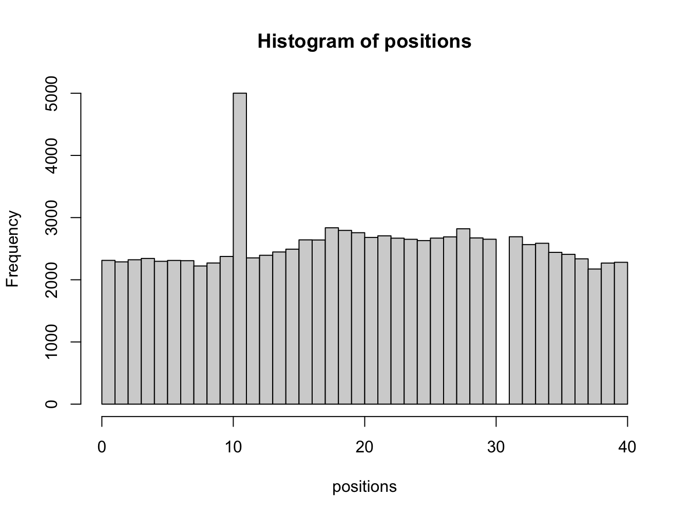
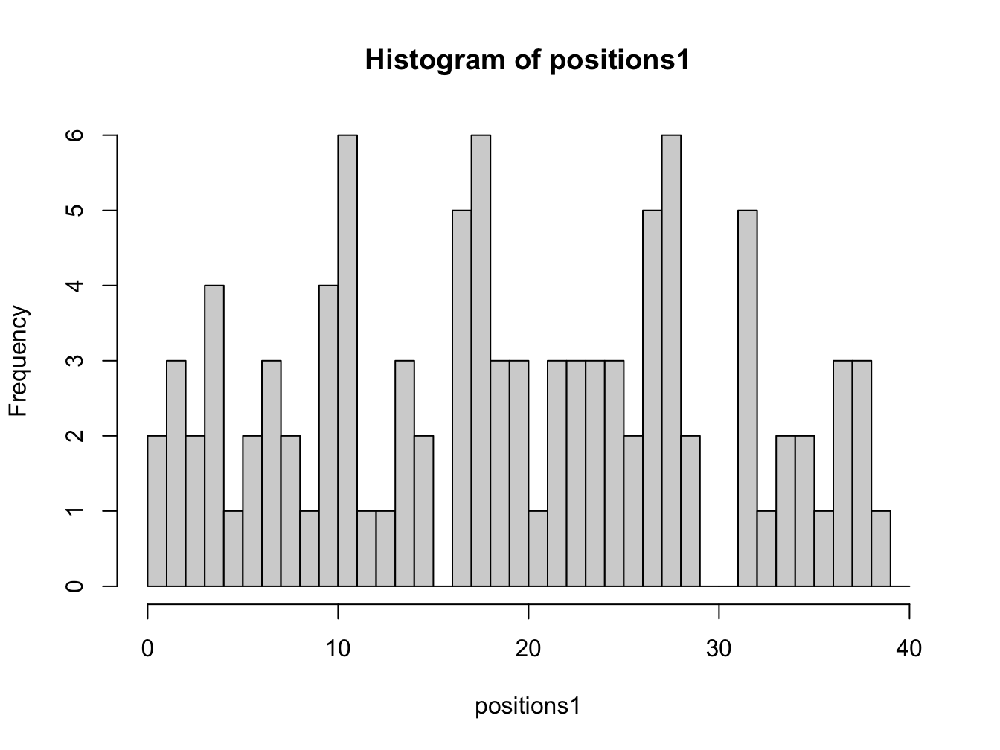
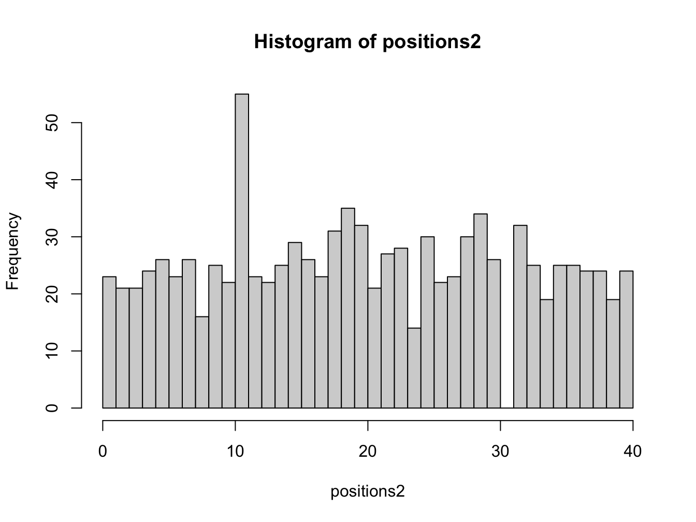
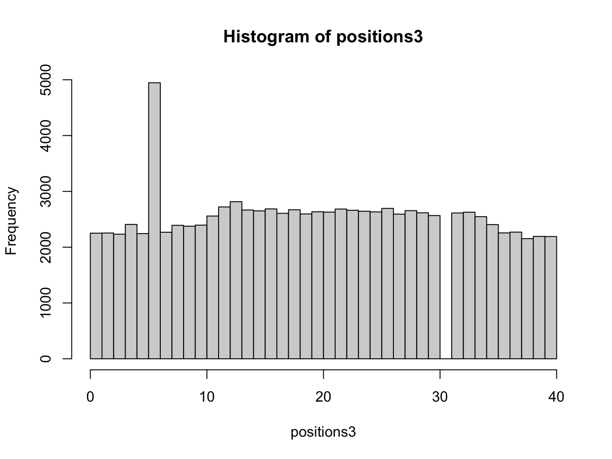
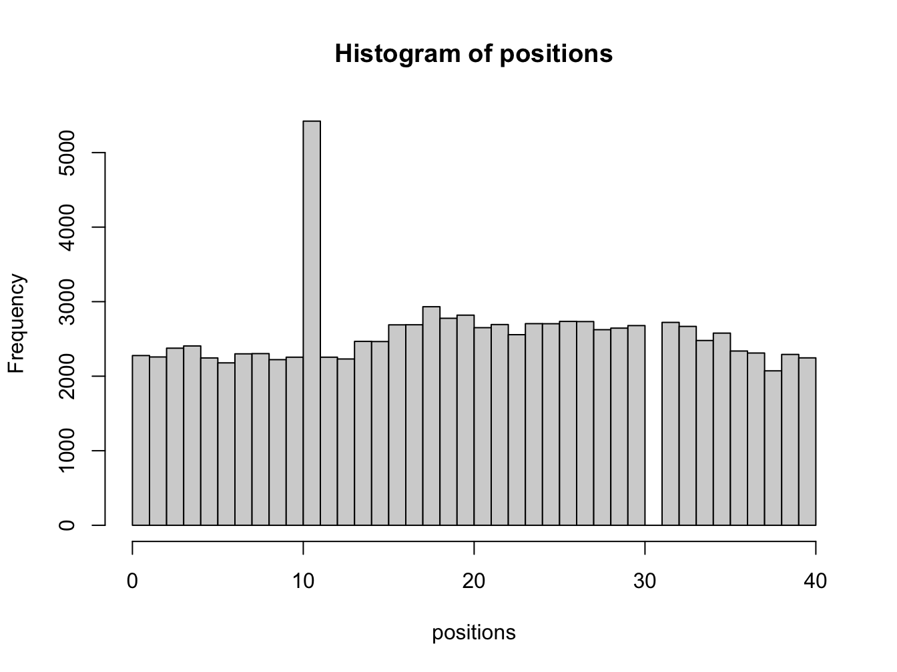
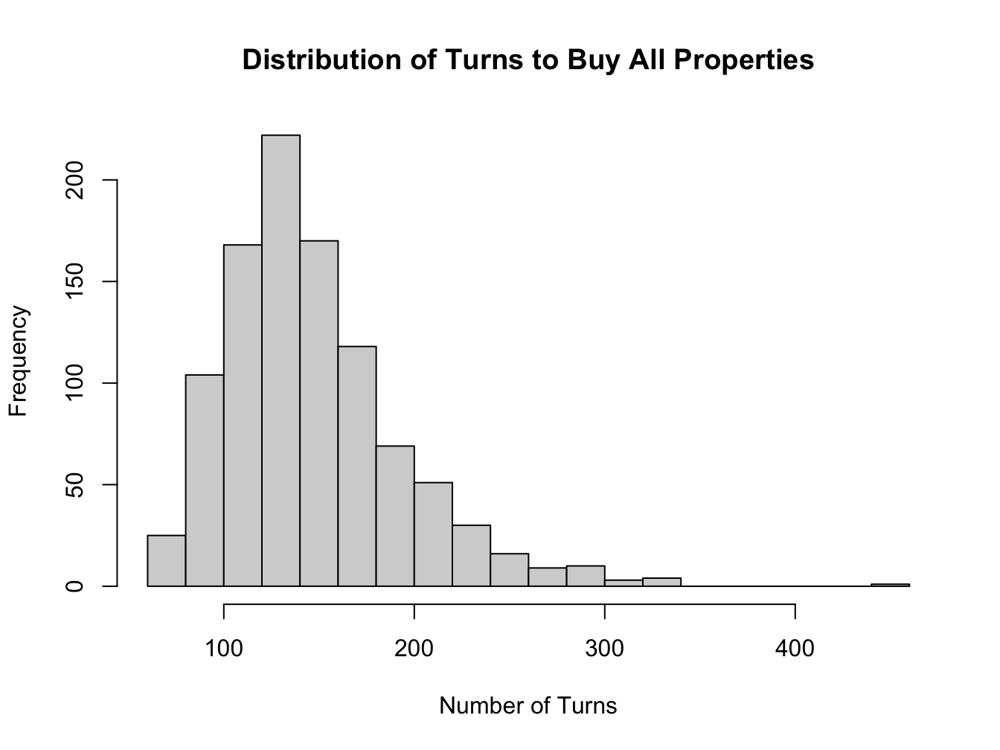

# Solution: Monopoly {#monopolySol}

## Solution: Monopoly Function {#monopolyFun-sol}


```{.r .numberLines}
monopoly_sim <- function(num_turns) {

  current_board_position <- 0 # start on the GO space
  go_to_jail_position <- 30 # the go to jail space
  jail_position <- 10 # jail space

  positions_visited <- rep(0, num_turns)

  # use a for loop to simulate a number of turns
  for (turn in 1:num_turns) {

    # roll two dice
    die_values <- sample(c(1:6), 2, replace = TRUE)

    # move player position

    # number of positions to move
    plus_move <- sum(die_values)

    # compute new board position
    new_board_position <- current_board_position + plus_move

    # if land on GO TO JAIL square, then go backwards to the JAIL square
    if (new_board_position == go_to_jail_position) {
      new_board_position <- jail_position
    }

    # update board position (this corrects for the fact the board is circular)
    current_board_position <- (new_board_position %% 40)

    # store position visited
    positions_visited[turn] <- current_board_position

  }

  return(positions_visited)

}
```

If you are using an `Rmarkdown` file it is better to put the function in a script file and then source the file. This way you can reuse the function in multiple files.

**Best practices for organizing R code:**

- **Create a separate R script**: Save your function as `monopoly_functions.R` in the same directory
- **Source the file**: Use `source("monopoly_functions.R")` at the top of your Rmarkdown document
- **Alternative**: Use `source(here::here("monopoly_functions.R"))` for more robust file paths

**Useful resources:**

- [R for Data Science - Functions chapter](https://r4ds.had.co.nz/functions.html) - Clear explanations with examples
- [Advanced R - Functions](https://adv-r.hadley.nz/functions.html) - More detailed coverage for advanced users
- [Posit Support - Using R Scripts](https://support.posit.co/hc/en-us/articles/200526207-Using-Projects-in-the-RStudio-IDE) - Managing R files and projects

If you have followed these steps, you would now have a working function that simulates a game of Monopoly for a specified number of turns and returns the positions visited during the game. To run it for a specific number of turns, you first need to source the file containing the function:


```{.r .numberLines}
source("monopoly_functions.R") # or use here::here for robust paths
```

Only once you have sourced the file can you call the function, for example:


```{.r .numberLines}
positions <- monopoly_sim(100000) # simulate 100,000 turns
hist(positions, breaks = seq(0, 40, len = 41), right = FALSE)
```



Note, to ensure this code works it is important to try different values for the input argument `num_turns` to ensure the function behaves as expected.

<button class="button">
  [Back to exercise](#monopolyFunc)
</button>

## Going to Jail - function {#goJailMon-sol}


```{.r .numberLines}
monopoly_jail_sim <- function(num_turns = 100, jail_position = 10) {
  current_board_position <- 0 # start on the GO space
  go_to_jail_position <- 30 # the go to jail space

  positions_visited <- rep(0, num_turns)

  # use a for loop to simulate a number of turns
  for (turn in 1:num_turns) {

    # roll two dice
    die_values <- sample(c(1:6), 2, replace = TRUE)

    # move player position

    # number of positions to move
    plus_move <- sum(die_values)

    # compute new board position
    new_board_position <- current_board_position + plus_move

    # if land on GO TO JAIL square, then go backwards to the JAIL square
    if (new_board_position == go_to_jail_position) {
      new_board_position <- jail_position
    }

    # update board position (this corrects for the fact the board is circular)
    current_board_position <- (new_board_position %% 40)

    # store position visited
    positions_visited[turn] <- current_board_position

  }

  return(positions_visited)
}
```

You can see that be adding the `jail_position` argument with a default value of 10, the function is more flexible. You can now call the function with just the number of turns, or specify a different jail position if needed. We have also added default value for `num_turns` to 100, so if you call the function without any arguments it will simulate 100 turns by default. Let us run the function without any arguments, and by choosing a different jail position, and different number of turns:


```{.r .numberLines}
# simulate 100 turns with default jail position
positions1 <- monopoly_jail_sim()
hist(positions1, breaks = seq(0, 40, len = 41), right = FALSE)
```



```{.r .numberLines}
# simulate 1000 turns with default jail position
positions2 <- monopoly_jail_sim(1000)
hist(positions2, breaks = seq(0, 40, len = 41), right = FALSE)
```



```{.r .numberLines}
# simulate 100000 turns with jail position at 5
positions3 <- monopoly_jail_sim(100000, jail_position = 5)
hist(positions3, breaks = seq(0, 40, len = 41), right = FALSE)
```



<span style ="color: orange;">
  **Explain the results qualitatively.**
</span>

<button class="button">
  [Back to exercise](#goJailMon)
</button>

## Solution: Rolling three doubles {#3doubleMon-sol}

> You can also go to jail, if you roll three doubles (both dice having the same value) in a row. Update your code to allow for the possibility of going to Jail with three doubles. How does the distribution of board positions change?

The best process is to add the new feature to the existing code. This way we can compare the results with and without the new feature.


```{.r .numberLines}
monopoly_double_sim <- function(num_turns, jail_position = 10) {

  current_board_position <- 0 # start on the GO space
  go_to_jail_position <- 30 # the go to jail space

  positions_visited <- rep(0, num_turns)

  # use a for loop to simulate a number of turns
  for (turn in 1:num_turns) {

    # set double counter to zero
    double_counter <- 0

    # roll (max) three times
    for (j in 1:3) {

      # roll two dice
      die_values <- sample(c(1:6), 2, replace = TRUE)

      # if we have rolled a double for the third time, we proceed straight to jail
      if ((die_values[1] == die_values[2]) && (double_counter == 2)) {
        current_board_position <- jail_position
        break
      }

      # otherwise

      # move player position

      # number of positions to move
      plus_move <- sum(die_values)

      # compute new board position
      new_board_position <- current_board_position + plus_move

      # if land on GO TO JAIL square, then go backwards to the JAIL square
      if (new_board_position == go_to_jail_position) {
        new_board_position <- jail_position
      }

      # update board position (this corrects for the fact the board is circular)
      current_board_position <- (new_board_position %% 40)

      # break out of loop if we roll a non-double
      if (die_values[1] != die_values[2]) {
        break
      } else { # increment double counter
        double_counter <- double_counter + 1
      }

    }

    # store final position visited
    positions_visited[turn] <- current_board_position

  }

  return(positions_visited)
}

# Example usage:
positions <- monopoly_double_sim(100000)
hist(positions, breaks = seq(0, 40, len = 41), right = FALSE)
```



Adding the rolling doubles feature doesn't seem to change much. We might expect this since rolling three doubles is a very unlikely event!

*Note, here we have created the function within the solution for clarity, but in practice, you would define this function in your script file as described earlier. Make sure you do that, you can also have multiple functions in one file, try that!*

<button class="button">
  [Back to exercise](#repDoublesMon)
</button>


## Solution: Monopoly Extension {#monopolyExtSol}

For example, the following simple extension of the previous example adds some features to record properties being purchased. This simulation is constructed based on the assumption that a players always buys any free property that land on.


```{.r .numberLines}
monopoly_ext_sim <- function(num_turns, jail_position = 10) {

  current_board_position <- 0 # start on the GO space
  go_to_jail_position <- 30 # the go to jail space

  # vector of squares containing properties
  properties_that_can_be_bought <- c(
    1, 3, 5, 6, 8, 9, 11, 12, 13, 14, 15, 16,
    18, 19, 21, 23, 24, 25, 26, 27, 28, 29, 31, 32, 34, 35, 37, 39
  )

  positions_visited <- rep(0, num_turns)
  positions_purchased <- rep(0, 40)
  properties_bought <- rep(0, num_turns)

  # use a for loop to simulate a number of turns
  for (turn in 1:num_turns) {

    # roll two dice
    die_values <- sample(c(1:6), 2, replace = TRUE)

    # move player position

    # number of positions to move
    plus_move <- sum(die_values)

    # compute new board position
    new_board_position <- current_board_position + plus_move

    # if land on GO TO JAIL square, then go backwards to the JAIL square
    if (new_board_position == go_to_jail_position) {
      new_board_position <- jail_position
    }

    # update board position (corrects for circular board)
    current_board_position <- (new_board_position %% 40)

    # if we land on a square that can be purchased and which has not been
    # purchased (note R uses 1-indexing for arrays)
    if (positions_purchased[current_board_position + 1] == 0) {
      if (current_board_position %in% properties_that_can_be_bought) {
        positions_purchased[current_board_position + 1] <- 1
      }
    }

    # store position visited
    positions_visited[turn] <- current_board_position

    # store number of properties bought
    properties_bought[turn] <- sum(positions_purchased)

    # check if all properties are bought
    if (properties_bought[turn] == length(properties_that_can_be_bought)) {
      # truncate vectors to actual length used
      positions_visited <- positions_visited[1:turn]
      properties_bought <- properties_bought[1:turn]
      break
    }

  }

  # return a list with multiple pieces of information
  return(list(
    positions_visited = positions_visited,
    properties_bought_timeline = properties_bought,
    positions_purchased = positions_purchased,
    turns_to_buy_all = ifelse(
      max(properties_bought) == length(properties_that_can_be_bought),
      length(positions_visited), NA
    ),
    total_properties = length(properties_that_can_be_bought),
    properties_available = properties_that_can_be_bought
  ))
}

# Example usage for a single game:
game_result <- monopoly_ext_sim(1000)
print(paste("Turns to buy all properties:", game_result$turns_to_buy_all))
```

``` bg-info
#> [1] "Turns to buy all properties: 146"
```

```{.r .numberLines}
print(paste("Total properties bought:",
            max(game_result$properties_bought_timeline)))
```

``` bg-info
#> [1] "Total properties bought: 28"
```

```{.r .numberLines}
# Example usage for multiple games to analyze distribution:
num_games <- 1000
time_to_buy_all_properties <- rep(NA, num_games)

for (game in 1:num_games) {
  result <- monopoly_ext_sim(1000)
  time_to_buy_all_properties[game] <- result$turns_to_buy_all
}

# Remove NA values (games where not all properties were bought)
time_to_buy_all_properties <- time_to_buy_all_properties[
  !is.na(time_to_buy_all_properties)
]

hist(time_to_buy_all_properties, breaks = 20,
     main = "Distribution of Turns to Buy All Properties",
     xlab = "Number of Turns")
```



This code simulates 1000 games of Monopoly and records the number of turns it takes to buy all properties. The histogram shows the distribution of the number of turns it takes to buy all properties.

What is the distribution of the number of turns it takes to buy all properties?

Would it be possible to extend this simulation to include more features of the game?

<button class="button">
  [Back to exercise](#monopolyExt)
</button>
