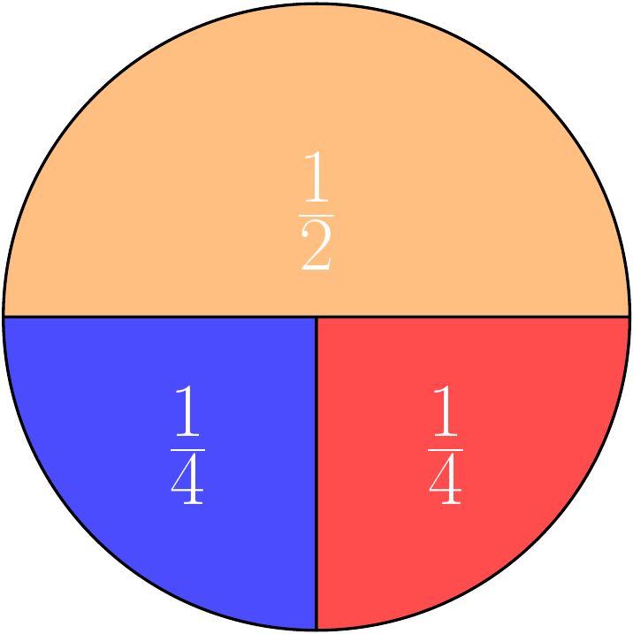

# Monte Carlo Methods

Monte Carlo (MC) simulations provide a means to model a problem and apply brute force computational power to achieve a solution - randomly simulate from a model until you get an answer. The idea is similar to what we went through in the lecture. The best way to explain is to just run through a bunch of examples, so lets go!

Make sure you not only run the code but also try to understand what is happening at each step. This will help you to understand the concept better. Read the content carefully not just the code to get the most out of this practical and ask questions if you are unsure about anything.

## Integration

We will start with basic integration. If you are not familiar with the concept please refer to the wikipedia page on [integration](https://en.wikipedia.org/wiki/Integral). In simple terms it is the area under a curve. In the context of continuous random variables (RVs) it is the probability of a RV falling within a certain range. You are not required to know how to perform an integration by hand, but in the context of continuous RVs you should understand how to perform an integration using MC and what it means. Throughout this exercise try to relate it back to what you saw during the lecture and the information each integral provides.

This is an extremely powerful tool and is used in many fields including Machine Learning to solve problems that are too complex to solve analytically. The basic idea is to simulate a large number of samples from a distribution and then use these samples to estimate the integral.

Suppose we have an instance of a Normal distribution with a mean of 1 and a standard deviation of 2 then we want to find the *integral* (area under the curve) from 1 to 3. We can write this formally using the Normal distribution function as:

\[
 \int_1^3 \frac{1}{10 \sqrt{2\,\pi}}\, e^{- \frac{(x - 1)^2}{2\times 2^2}}dx
\]

which we can visualise as follows:


If you have not done calculus before - do not worry. We are going to write a Monte Carlo approach for estimating this integral which does not require any knowledge of calculus!

The method relies on being able to generate samples from this distribution (the blue curve) and counting how many values fall between 1 and 3. The proportion of samples that fall in this range over the total number of samples gives the area.

### Monte Carlo Integration

Like before we will set up a simulation, this time to estimate the integral of a Normal distribution. We will go step by step to understand the process and then we will write a function to do this for us.

First, create a new `R` script in `Rstudio`. Next we define the number of samples we will obtain. Lets start by choosing $1,000$ samples:


```{.r .numberLines}
n <- 1000 # number of samples to take
```

Now we use the `R` function `rnorm` to simulate $1,000$ numbers from a Normal distribution with mean 1 and standard deviation 2:


```{.r .numberLines}
sims <- rnorm(n, mean = 1, sd = 2) # simulated normally distributed numbers
```

Lets estimate the integral between 1 and 3 by counting how many samples had a value in this range. We can do this by summing the number of samples that are greater than or equal to 1 and less than or equal to 3 and dividing by the total number of samples:


```{.r .numberLines}
# find proportion of values between 1-3
mc_integral <- sum(sims >= 1 & sims <= 3) / n
```
The result we get is:


```{.r .numberLines}
print(mc_integral)
```

``` bg-info
#> [1] 0.329
```

This is our estimate of the integral. We can compare this to the true value of the integral which we can calculate using the `pnorm` function in `R`. This is the probability of a Normal distribution falling between 1 and 3:


```{.r .numberLines}
mc_exact <- pnorm(q = 3, mean = 1, sd = 2) - pnorm(q = 1, mean = 1, sd = 2)
print(mc_exact)
```

``` bg-info
#> [1] 0.3413447
```

Let's break down the above code, to understand what is happening. The `pnorm` gives the integral under the Normal distribution (in this case with mean 1 and standard deviation 2) from negative infinity up to the value specified by `q`.

The first call to `pnorm(q=3, mean=1, sd=2)` gives us this integral:


The second call to `pnorm(q=1, mean=1, sd=2)` gives us this integral:


Therefore the difference between these gives us the integral of interest between 1 and 3.

::: {.rmdnote }
<center>
**The Monte Carlo estimate is a fairly good approximation to the true value!**

Note that the accuracy of the estimate will depend on the number of samples taken. The more samples taken, the more accurate the estimate will be.
</center>
:::

::: {.infobox}
## Exercise: MC accuracy {#mc-accuracy}

Let us now explore how the accuracy of the Monte Carlo estimate changes as the number of samples increases. We will repeat the above process for different numbers of samples and compare the accuracy of the estimate to the true value.

1. Try increasing the number of simulations and see how the accuracy improves?
2. Can you draw a graph of number of MC samples vs accuracy?

<details>

<summary style="color:darkorange;">Hint</summary>

Split up the task into two parts. First, write a loop to run the simulation for different numbers of samples and store the results. Then, use `ggplot2` (or base `R` plotting) to plot the results.

A few questions to answer:

1. How do you define accuracy?
2. How do you store the results of the simulation?
3. How many simulations do you need to run to get a good estimate of the accuracy?

Don't worry if you don't get it right the first time, you can change the parameters and try again.

Keep trying and ask for help if you need it.

</details>

<button class="button">
  [Show Solution](#solution-mc-accuracy)
</button>
:::

## Approximating the Binomial Distribution

Now we will consider a different problem, bust using the same techniques. Suppose we have a fair coin and we want to know the probability of getting more than 3 heads in 10 flips. This is a trivial problem using the Binomial distribution but suppose we have forgotten about this or never learned it in the first place.

Lets solve this problem with a Monte Carlo simulation. We will use the common trick of representing tails with 0 and heads with 1, then simulate 10 coin tosses 100 times and see how often that happens.


```{.r .numberLines}
runs <- 100 # number of simulations to run

greater_than_three <- rep(0, runs) # vector to hold outcomes

# run 100 simulations
for (i in 1:runs) {

  # flip a coin ten times (0 - tail, 1 - head)
  coin_flips <- sample(c(0, 1), 10, replace = T)

  # count how many heads and check if greater than 3
  greater_than_three[i] <- (sum(coin_flips) > 3)
}

# compute average over simulations
pr_greater_than_three <- sum(greater_than_three) / runs
```

For our MC estimate of the probability \(P(X>3)\) we get


```{.r .numberLines}
print(pr_greater_than_three)
```

``` bg-info
#> [1] 0.81
```

which we can compare to `R`’s built-in Binomial distribution function:


```{.r .numberLines}
print(pbinom(3, 10, 0.5, lower.tail = FALSE))
```

``` bg-info
#> [1] 0.828125
```

Not bad! **The Monte Carlo estimate is close to the true value.**

::: {.infobox}
## Problem: MC Binomial

Let's expand this once again trying to see the impact of the number of simulations on the accuracy of the estimate.

1. Try increasing the number of simulations and see how the accuracy improves?
2. Can you plot how the accuracy varies as a function of the number of simulations?


(Hint: see the previous section, the solution is very similar)

:::

## Monte Carlo Expectations

Let us look at a more interesting problem after understanding how MC works and we have convinced ourselves that it works and produces accurate results.

Consider the following spinner. If the spinner is spun randomly then it has a probability 0.5 of landing on yellow and 0.25 of landing on red or blue respectively.



If the rules of the game are such that landing on *yellow* you gain 1 point,* red* you lose 1 point and *blue* you gain 2 points. We can easily calculate the expected score.

::: {.infobox}
<strong> THINK</strong>

How does this relate to probabilities? What is the random variable here and what type of RV are we dealing with?
:::

You should take out a pad of paper and construct this problem into a probability problem. This is a key skill in probability and statistics. Once you have done this, you can then write a Monte Carlo simulation to estimate the expected score.

<details>
<summary style="color:darkorange;">Constructing the probability</summary>

The problem can be considered as an example of the expectation of a random variable. The expectation is the average value of a random variable and is a key concept in probability theory. It is defined as:

\[
E[X] = \sum_{i=1}^{n} x_i \times p_i
\]

where \(x_i\) are the values of the random variable and \(p_i\) are the probabilities of each value. The expectation is a measure of the central tendency of a random variable and is a key concept in probability theory.

This translates Let \(X\) denote the random variable associated with the score of the spin then:

\[
    E[X] = \frac{1}{2} \times 1 + \frac{1}{4} \times (-1) + \frac{1}{4} \times 2 = 0.75
\]

</details>

\

::: {.infobox}

## Exercise: MC Expectation 1 {#mc-expectation-1}

We can also ask more challenging questions. Let us consider the following problem:

**After 20 spins what is the probability that you will have less then 0 points?**

How might we solve this?

Of course, there are methods to analytically solve this type of problem but by the time they are even explained we could have already written our simulation!

<details>
<summary style="color:darkorange;">Hint</summary>
To solve this with a Monte Carlo simulation you need to sample from the Spinner 20 times, and return 1 if we are below 0 other wise we will return 0. We will repeat this 10,000 times to see how often it happens!

</details>

<button class="button">
  [Show Solution](#solution-mc-expectation-1)
</button>
:::

## Using Functions

We now move to another essential concept in programming - functions. You would have already encountered functions in `R` and other programming languages. Functions are a way to encapsulate code so that it can be reused. This is a key concept in programming and is used to make code more readable and maintainable.

A function is a piece of code which is encapsulated so then we can refer to it repeatedly via the name of the function rather than repeatedly writing those lines of code. If you would like to learn more about functions in R, you can read [this](https://www.datacamp.com/community/tutorials/functions-in-r-a-tutorial) tutorial or the software carpentry [lesson](https://bham-carpentries.github.io/R-course-material/10-functions/index.html).

Here is an example function we can write to simulate one game as indicated above and return whether the number of points is less than zero.


```{.r .numberLines}
# simulates a game of 20 spins
play_game <- function(){
    # picks a number from the list (1, -1, 2)
    # with probability 50%, 25% and 25% twenty times
  results <- sample(c(1, -1, 2), 20, replace = TRUE, prob = c(0.5, 0.25, 0.25))

  # function returns whether the sum of all the spins is < 1
  return(sum(results) < 0)
}
```

## Simulating from function

Now we can use this function in a loop to play the game 100 times:


```{.r .numberLines}
runs <- 100 # play the game 100 times

less_than_zero <- rep(0, runs) # vector to store outcome of each game
for (it in 1:runs) {
  # play the game by calling the function and store the outcome
  less_than_zero[it] <- play_game()
}
```

We can then compute the probability that, after twenty spins, we will have less than zero points:


```{.r .numberLines}
prob_less_than_zero <- sum(less_than_zero)/runs
print(prob_less_than_zero)
```

``` bg-info
#> [1] 0
```

The probability is very low. This is not surprising since there is only a 25% chance of getting a point deduction on any spin and a 75% chance of gaining points. Try to increase the number of simulation runs to see if you can detect any games where you do find a negative score.

::: {.infobox}

## Exercise: MC Expectation 2 {#mc-expectation-2}

1. Modify your code to allow you to calculate the expected number of points after 20 spins.
2. Simulate a game in which you have a maximum of 20 spins but you go “bust” once you hit a negative score and take this into account when you compute the expected end of game score.

<button class="button">
  [Show Solution](#solution-mc-expectation-2)
</button>

:::
