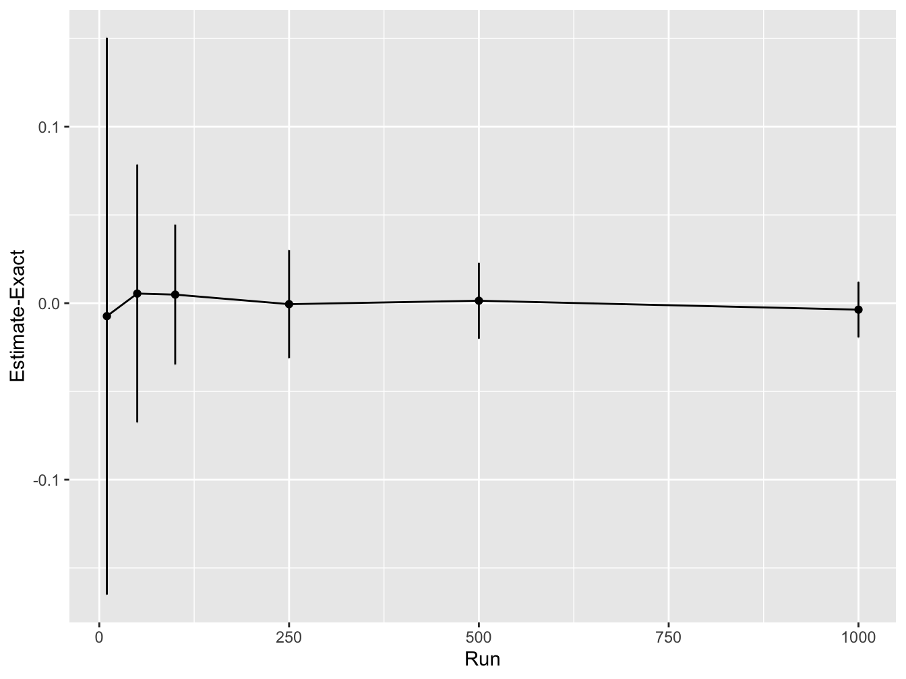
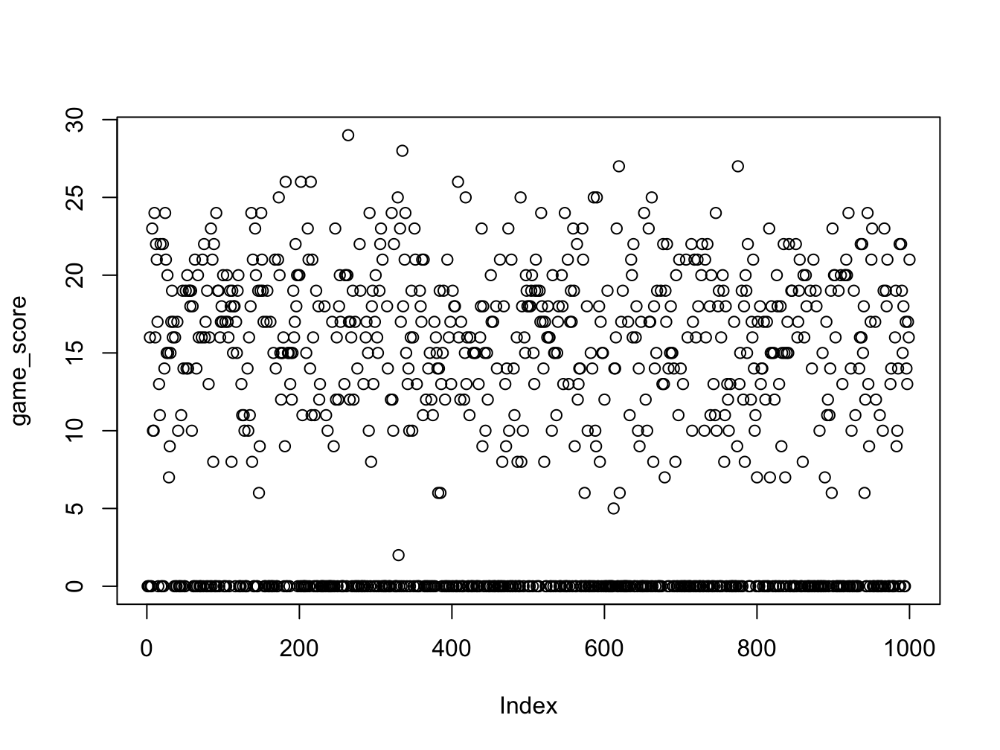

#  Solution: Monte Carlo

## Solution: MC accuracy {#solution-mc-accuracy}

To solve this problem we will write two functions. The first function will perform a single Monte Carlo estimate of the integral for a given sample size. The second function will call the first function multiple times and compute the accuracy statistics (mean and standard deviation of the error).

This is generally good practice when writing code. Breaking down the problem into smaller functions makes the code easier to read, debug and maintain.


```{.r .numberLines}
# Function to perform a single Monte Carlo integration estimate
monte_carlo_integral <- function(sample_size, lower = 1, upper = 3,
                                mean = 1, sd = 2) {
  # Simulate normally distributed numbers
  sims <- rnorm(sample_size, mean = mean, sd = sd)
  # Find proportion of values between lower and upper bounds
  mc_estimate <- sum(sims >= lower & sims <= upper) / sample_size
  return(mc_estimate)
}

# Function to estimate Monte Carlo accuracy for a given sample size
estimate_mc_accuracy <- function(sample_size, rpts = 100, lower = 1, upper = 3,
                                mean = 1, sd = 2) {
  # Calculate exact value of the integral
  mc_exact <- pnorm(q = upper, mean = mean, sd = sd) -
              pnorm(q = lower, mean = mean, sd = sd)

  # Vector to store results from each repeat
  mc_estimates <- rep(0, rpts)

  # Repeat the Monte Carlo estimation rpts times
  for (j in 1:rpts) {
    mc_estimates[j] <- monte_carlo_integral(sample_size, lower, upper, mean, sd)
  }

  # Return list with accuracy statistics
  return(list(
    mean_error = mean(mc_estimates - mc_exact),
    sd_error = sd(mc_estimates - mc_exact),
    estimates = mc_estimates,
    exact_value = mc_exact
  ))
}
```

We have created the two functions, ideally place them in a separate script file and source them in your main script. Now we can use these functions to estimate the accuracy for different sample sizes.


```{.r .numberLines}
# Define sample sizes to test
sample_sizes <- c(10, 50, 100, 250, 500, 1000)
n_sample_sizes <- length(sample_sizes)
rpts <- 100 # number of repeats for each sample size

# Initialize vectors to store results
accuracy <- rep(0, n_sample_sizes)
accuracy_sd <- rep(0, n_sample_sizes)

# Loop across sample sizes using our function
for (i in 1:n_sample_sizes) {
  result <- estimate_mc_accuracy(sample_sizes[i], rpts = rpts)
  accuracy[i] <- result$mean_error
  accuracy_sd[i] <- result$sd_error
}

cat("Mean errors:", accuracy)
```

``` bg-info
#> Mean errors: -0.02634475 0.001455254 -0.005944746 0.002015254 -0.002964746 -0.003034746
```

```{.r .numberLines}
cat("Standard deviation of errors:", accuracy_sd)
```

``` bg-info
#> Standard deviation of errors: 0.1513408 0.06630325 0.04812484 0.03069943 0.01870925 0.0160559
```

Next, we will plot the results. Here we will make use of `ggplot2` a library to create nice plots without much effort. The input need to be a `data.frame` so we will need to create one based on the data.


```{.r .numberLines}
# load ggplot
library(ggplot2)

# create a data frame for plotting
df <- data.frame(sample_sizes, accuracy, accuracy_sd)

print(df)
```

``` bg-info
#>   sample_sizes     accuracy accuracy_sd
#> 1           10 -0.026344746  0.15134081
#> 2           50  0.001455254  0.06630325
#> 3          100 -0.005944746  0.04812484
#> 4          250  0.002015254  0.03069943
#> 5          500 -0.002964746  0.01870925
#> 6         1000 -0.003034746  0.01605590
```

```{.r .numberLines}
# use ggplot to plot lines for the mean accuracy and error bars
# using the std dev
ggplot(df, aes(x = sample_sizes, y = accuracy)) +
  geom_line() +
  geom_point() +
  geom_errorbar(
      aes(ymin = accuracy - accuracy_sd, ymax = accuracy + accuracy_sd),
          width = .2,
          position = position_dodge(0.05)) +
  ylab("Estimate-Exact") +
  xlab("Run")
```



This shows that as the number of Monte Carlo samples is increased, the accuracy increases (i.e. the difference between the estimated integral value and real values converges to zero). In addition, the variability in the integral estimates across different simulation runs reduces.

<button class="button">
  [Back to Exercise](#mc-accuracy)
</button>

## MC Expectation

### Solution: MC Expectation 1 {#solution-mc-expectation-1}


```{.r .numberLines}
# simulates a game of 20 spins
play_game <- function() {
    # picks a number from the list (1, -1, 2)
    #  with probability 50%, 25% and 25% twenty times
  results <- sample(c(1, -1, 2), 20, replace = TRUE, prob = c(0.5, 0.25, 0.25))
  return(sum(results)) # function returns the sum of all the spins
}

# Define the number of runs
runs <- 100

score_per_game <- rep(0, runs) # vector to store outcome of each game
for (it in 1:runs) {
  score_per_game[it] <- play_game() # play the game by calling the function
}
expected_score <- mean(score_per_game) # average over all simulations

print(expected_score)
```

``` bg-info
#> [1] 14.64
```
<button class="button">
  [Back to Exercise](#mc-expectation-1)
</button>

### Solution: MC Expectation 2 {#solution-mc-expectation-2}


```{.r .numberLines}
# simulates a game of up to n_spins
play_game <- function(n_spins) {
    # picks a number from the list (1, -1, 2)
    #  with probability 50%, 25% and 25% n_spins times
  results <- sample(c(1, -1, 2), n_spins,
    replace = TRUE, prob = c(0.5, 0.25, 0.25))
  results_sum <- cumsum(results) # compute a running sum of points
  # check if the game goes to zero at any point
  if (sum(results_sum <= 0)) {
    return(0) # return zero
  } else {
    return(results_sum[n_spins]) # returns the final score
  }
}

runs <- 1000
game_score <- rep(0, runs) # vector to store scores in each game played

# for each game
for (it in 1:runs) {
  game_score[it] <- play_game(n_spins = 20)
}

print(mean(game_score))
```

``` bg-info
#> [1] 9.281
```

```{.r .numberLines}
plot(game_score)
```



::: {.rmdnote}

**Functions and Arguments**

The function `play_game` has an argument `n_spins` which allows you to specify the number of spins in the game. This makes the function more flexible, as you can now simulate games with different numbers of spins by simply changing the value of `n_spins` when calling the function. Note that because it is a function argument, you do not need to define `n_spins` outside the function before calling it. You can simply pass the desired value directly when you call the function, as shown in the loop where we call `play_game(n_spins = 20)`. This is different from a for loop or while loop where the loop variable needs to be defined before the loop starts.
:::


The games with score zero now corresponds to the number of games where we went bust (or genuinely ended the game with zero).

This is a simple example of how Monte Carlo simulations can be used to estimate the expected value of a random variable. The more simulations you run, the more accurate the estimate will be. You can imagine that this could be used to estimate the expected value of a random variable for biological systems where the underlying distribution is unknown or too complex to model directly. You could even come up with an example considering say mutations in a population of bacteria that have a certain probability of being beneficial, neutral or harmful.

#### Extend the function

We can extend the `play_game` function to allow for different probabilities and point values.


```{.r .numberLines}
# updated play_game function
play_game <- function(n_spins, point_values = c(1, -1, 2),
                      probabilities = c(0.5, 0.25, 0.25)) {
  # picks a number from the point_values
  #  with given probabilities n_spins times
  results <- sample(point_values, n_spins,
                    replace = TRUE, prob = probabilities)
  results_sum <- cumsum(results) # compute a running sum of points
  # check if the game goes to zero at any point
  if (sum(results_sum <= 0)) {
    return(0) # return zero
  } else {
    return(results_sum[n_spins]) # returns the final score
  }
}
```

Now we can experiment with different parameters. To do that effectively we will define a set of scenarios with different point values and probabilities. We will then loop through these scenarios, simulate the game multiple times for each scenario, and compute the expected score. Finally, we will create a table to summarize the results.


```{.r .numberLines}
# Define scenarios for experimentation
scenarios <- list(
  scenario1 = list(
    point_values = c(1, -1, 2),
    probabilities = c(0.5, 0.25, 0.25),
    description = "Original Game"
  ),
  scenario2 = list(
    point_values = c(1, -1, 2),
    probabilities = c(0.4, 0.3, 0.3),
    description = "Higher chance of non-positive outcomes"
  ),
  scenario3 = list(
    point_values = c(2, -2, 4),
    probabilities = c(0.5, 0.25, 0.25),
    description = "Higher stakes"
  ),
  scenario4 = list(
    point_values = c(1, -1, 5),
    probabilities = c(0.5, 0.25, 0.25),
    description = "High reward for one outcome"
  )
)

# Initialize a data frame to store results
results_table <- data.frame(
  Scenario = character(),
  Expected_Score = numeric(),
  stringsAsFactors = FALSE
)

runs <- 1000

# Loop through each scenario
for (scenario_name in names(scenarios)) {
  scenario <- scenarios[[scenario_name]]
  game_scores <- replicate(runs, play_game(
    n_spins = 20,
    point_values = scenario$point_values,
    probabilities = scenario$probabilities
  ))

  mean_score <- mean(game_scores)

  # Add result to the table
  results_table <- rbind(results_table, data.frame(
    Scenario = scenario$description,
    Expected_Score = mean_score
  ))
}

# Print the results table
knitr::kable(
  results_table,
  caption = "Experimenting with different game parameters"
)
```


Table: (\#tab:unnamed-chunk-7)Experimenting with different game parameters

|Scenario                               | Expected_Score|
|:--------------------------------------|--------------:|
|Original Game                          |          9.451|
|Higher chance of non-positive outcomes |          8.661|
|Higher stakes                          |         19.346|
|High reward for one outcome            |         19.484|

<button class="button">
  [Back to Exercise](#mc-expectation-2)
</button>
