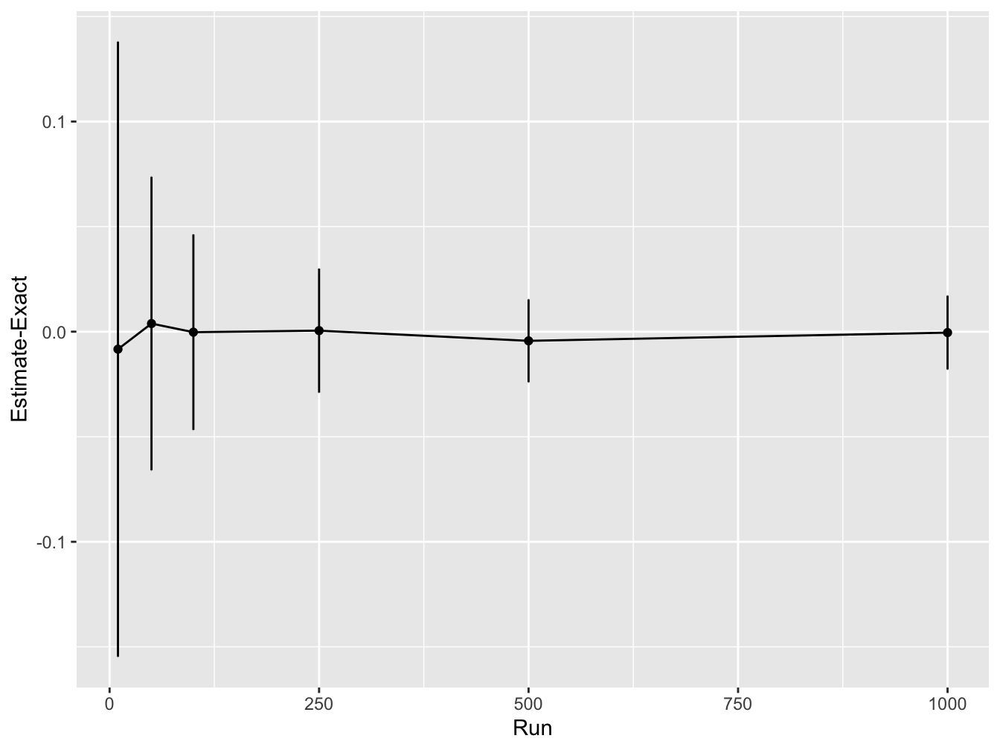

#  Solution: Monte Carlo

## Solution: MC accuracy {#solution-mc-accuracy}


First let's increase the number of simulations and out the accuracy


```{.r .numberLines}
sample_sizes <- c(10, 50, 100, 250, 500, 1000) # try different sample sizes
n_sample_sizes <- length(sample_sizes) # number of sample sizes to try
rpts <- 100 # number of repeats for each sample size
accuracy <- rep(0, n_sample_sizes) # vector to record accuracy values
accuracy_sd <- rep(0, n_sample_sizes) # vector to record accuracy sd values

# Let's store the exact value of the integral
mc_exact <- pnorm(q = 3, mean = 1, sd = 2) - pnorm(q = 1, mean = 1, sd = 2)

# for each sample size
for (i in 1:n_sample_sizes) {

  sample_sz <- sample_sizes[i] # select a sanmple size to use

  # vector to store results from each repeat
  mc_integral <- rep(0, rpts)
  for (j in 1:rpts){
    # simulated normally distributed numbers
    sims <- rnorm(sample_sz, mean = 1, sd = 2)
    # find proportion of values between 1-3
    mc_integral[j] <- sum(sims >= 1 & sims <= 3) / sample_sz
  }

  # compute average difference between integral estimate and real value
  accuracy[i] <- mean(mc_integral - mc_exact)
  # compute sd difference between integral estimate and real value
  accuracy_sd[i] <- sd(mc_integral - mc_exact)

}

print(accuracy)
```

``` bg-info
#> [1] -1.034475e-02 -4.344746e-03  2.555254e-03  2.952539e-04
#> [5] -2.084746e-03  1.525393e-05
```

```{.r .numberLines}
print(accuracy_sd)
```

``` bg-info
#> [1] 0.13831234 0.07159792 0.05024978 0.03175204 0.02110418
#> [6] 0.01673895
```

```{.r .numberLines}
print(accuracy + accuracy_sd)
```

``` bg-info
#> [1] 0.12796759 0.06725318 0.05280503 0.03204730 0.01901943
#> [6] 0.01675420
```

Next, we will plot the results. Here we will make use of `ggplot2` a library to create nice plots without much effort. The input need to be a `data.frame` so we will need to create one based on the data.


```{.r .numberLines}
# load ggplot
library(ggplot2)

# create a data frame for plotting
df <- data.frame(sample_sizes, accuracy, accuracy_sd)

print(df)
```

``` bg-info
#>   sample_sizes      accuracy accuracy_sd
#> 1           10 -1.034475e-02  0.13831234
#> 2           50 -4.344746e-03  0.07159792
#> 3          100  2.555254e-03  0.05024978
#> 4          250  2.952539e-04  0.03175204
#> 5          500 -2.084746e-03  0.02110418
#> 6         1000  1.525393e-05  0.01673895
```

```{.r .numberLines}
# use ggplot to plot lines for the mean accuracy and error bars
# using the std dev
ggplot(df, aes(x = sample_sizes, y = accuracy)) +
  geom_line() +
  geom_point() +
  geom_errorbar(
      aes(ymin = accuracy - accuracy_sd, ymax = accuracy + accuracy_sd),
          width = .2,
          position = position_dodge(0.05)) +
  ylab("Estimate-Exact") +
  xlab("Run")
```



This shows that as the number of Monte Carlo samples is increased, the accuracy increases (i.e. the difference between the estimated integral value and real values converges to zero). In addition, the variability in the integral estimates across different simulation runs reduces.

<button class="button">
  [Back to Exercise](#mc-accuracy)
</button>

## MC Expectation

### Solution: MC Expectation 1 {#solution-mc-expectation-1}


```{.r .numberLines}
# simulates a game of 20 spins
play_game <- function() {
    # picks a number from the list (1, -1, 2)
    #  with probability 50%, 25% and 25% twenty times
  results <- sample(c(1, -1, 2), 20, replace = TRUE, prob = c(0.5, 0.25, 0.25))
  return(sum(results)) # function returns the sum of all the spins
}

# Define the number of runs
runs <- 100

score_per_game <- rep(0, runs) # vector to store outcome of each game
for (it in 1:runs) {
  score_per_game[it] <- play_game() # play the game by calling the function
}
expected_score <- mean(score_per_game) # average over all simulations

print(expected_score)
```

``` bg-info
#> [1] 14.85
```
<button class="button">
  [Back to Exercise](#mc-expectation-1)
</button>

### Solution: MC Expectation 2 {#solution-mc-expectation-2}


```{.r .numberLines}
# simulates a game of up to 20 spins
play_game <- function() {
    # picks a number from the list (1, -1, 2)
    #  with probability 50%, 25% and 25% twenty times
  results <- sample(c(1, -1, 2), 20, replace = TRUE, prob = c(0.5, 0.25, 0.25))
  results_sum <- cumsum(results) # compute a running sum of points
  # check if the game goes to zero at any point
  if (sum(results_sum <= 0)) {
    return(0) # return zero
  } else {
    return(results_sum[20]) # returns the final score
  }
}

game_score <- rep(0, runs) # vector to store scores in each game played

# for each game
for (it in 1:runs) {
  game_score[it] <- play_game()
}

print(mean(game_score))
```

``` bg-info
#> [1] 9.16
```

```{.r .numberLines}
plot(game_score)
```


The games with score zero now corresponds to the number of games where we went bust (or genuinely ended the game with zero).

This is a simple example of how Monte Carlo simulations can be used to estimate the expected value of a random variable. The more simulations you run, the more accurate the estimate will be. You can imagine that this could be used to estimate the expected value of a random variable for biological systems where the underlying distribution is unknown or too complex to model directly. You could even come up with an example considering say mutations in a population of bacteria that have a certain probability of being beneficial, neutral or harmful.

<button class="button">
  [Back to Exercise](#mc-expectation-2)
</button>
