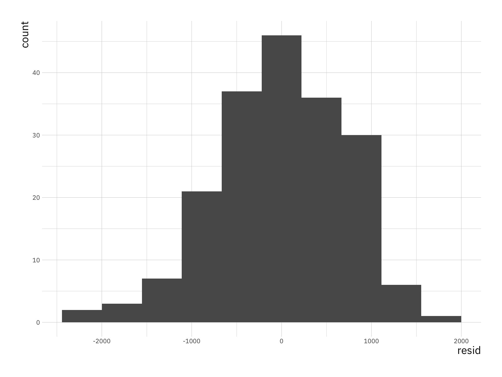
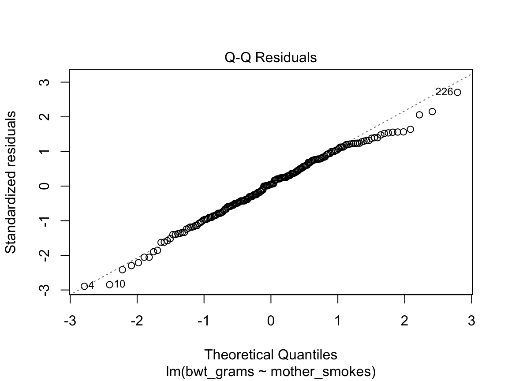
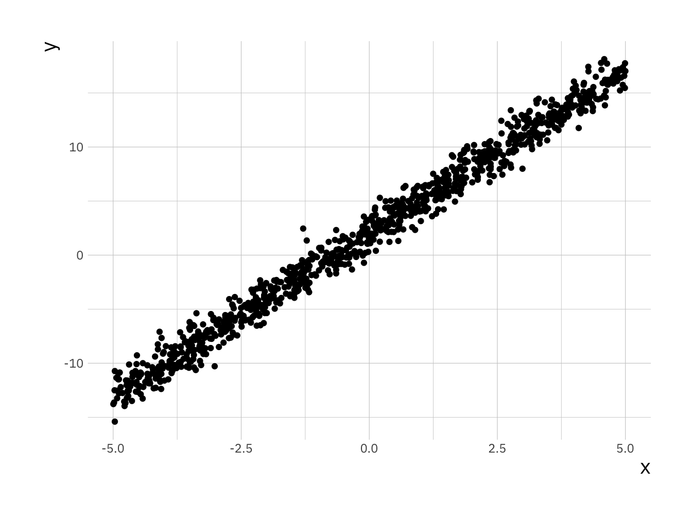
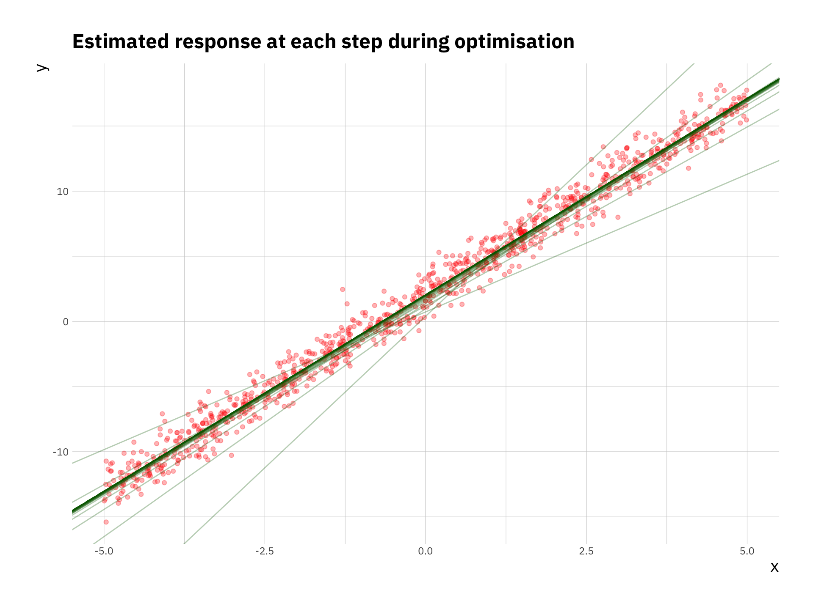

# Practical: Multiple regression

Previously we have only considered simple linear regression with one response variable and one feature. In this practical we will go through examples with multiple features:

$$y = \beta_0 + \beta_1 x_1 + \beta_2 x_2 + \epsilon $$

For this practical we will use data that is already inbuilt in R or is part of the `MASS` package. The only thing we need to do to make the data available is load the `MASS` package.

<!-- ```{r init}
# We load the MAASS package for plotting
library(MASS)

# We load the ggplot2 package for plotting
library(ggplot2)

``` -->


## Multiple regression

For this part we will use the inbuilt `trees` dataset containing `Volume`, `Girth` and `Height` data for 31 trees.

First we revisit linear regression on this example, recall the function to fit a linear model `lm()`. Consider `Volume` to be the response variable and `Girth` to be the covariate.


```{.r .numberLines}
lr_fit <- lm(Volume ~ Girth, data = trees)
summary(lr_fit)
```

``` bg-info
#> 
#> Call:
#> lm(formula = Volume ~ Girth, data = trees)
#> 
#> Residuals:
#>    Min     1Q Median     3Q    Max 
#> -8.065 -3.107  0.152  3.495  9.587 
#> 
#> Coefficients:
#>             Estimate Std. Error t value Pr(>|t|)    
#> (Intercept) -36.9435     3.3651  -10.98 7.62e-12 ***
#> Girth         5.0659     0.2474   20.48  < 2e-16 ***
#> ---
#> Signif. codes:  
#> 0 '***' 0.001 '**' 0.01 '*' 0.05 '.' 0.1 ' ' 1
#> 
#> Residual standard error: 4.252 on 29 degrees of freedom
#> Multiple R-squared:  0.9353,	Adjusted R-squared:  0.9331 
#> F-statistic: 419.4 on 1 and 29 DF,  p-value: < 2.2e-16
```

We will now consider a linear regression example with multiple covariates, `Girth` as well as `Height`. In this case of course we know that they are related so we do expect both covariates to be significant.


```{.r .numberLines}
mr_fit <- lm(Volume ~ Girth + Height, data = trees)


summary(mr_fit)
```

``` bg-info
#> 
#> Call:
#> lm(formula = Volume ~ Girth + Height, data = trees)
#> 
#> Residuals:
#>     Min      1Q  Median      3Q     Max 
#> -6.4065 -2.6493 -0.2876  2.2003  8.4847 
#> 
#> Coefficients:
#>             Estimate Std. Error t value Pr(>|t|)    
#> (Intercept) -57.9877     8.6382  -6.713 2.75e-07 ***
#> Girth         4.7082     0.2643  17.816  < 2e-16 ***
#> Height        0.3393     0.1302   2.607   0.0145 *  
#> ---
#> Signif. codes:  
#> 0 '***' 0.001 '**' 0.01 '*' 0.05 '.' 0.1 ' ' 1
#> 
#> Residual standard error: 3.882 on 28 degrees of freedom
#> Multiple R-squared:  0.948,	Adjusted R-squared:  0.9442 
#> F-statistic:   255 on 2 and 28 DF,  p-value: < 2.2e-16
```

*Note*, in the formula you only enter the covariates and not the regression coefficients or any information regarding the noise.

Let us now look at RSS values, we can calculate the RSS for the `lf_fit` object by using `sum(residuals(lr_fit)^2)`. We see that the RSS for LR = 524.3 and the RSS for MR = 421.92. Therefore the fit has improved but the regression coefficient for `Height` is very small and not significant.

One reason for this is that the in the relationship between `Volume`, `Girth`, and `Height` is not additive but rather `Girth` and `Height` are multiplied. Using the fact that $\log(a*b) = \log(a) + \log(b)$ we can consider the log-transformed data in a linear model.


```{.r .numberLines}
mrl_fit <- lm(log(Volume) ~ log(Girth) + log(Height), data = trees)

summary(mrl_fit)
```

``` bg-info
#> 
#> Call:
#> lm(formula = log(Volume) ~ log(Girth) + log(Height), data = trees)
#> 
#> Residuals:
#>       Min        1Q    Median        3Q       Max 
#> -0.168561 -0.048488  0.002431  0.063637  0.129223 
#> 
#> Coefficients:
#>             Estimate Std. Error t value Pr(>|t|)    
#> (Intercept) -6.63162    0.79979  -8.292 5.06e-09 ***
#> log(Girth)   1.98265    0.07501  26.432  < 2e-16 ***
#> log(Height)  1.11712    0.20444   5.464 7.81e-06 ***
#> ---
#> Signif. codes:  
#> 0 '***' 0.001 '**' 0.01 '*' 0.05 '.' 0.1 ' ' 1
#> 
#> Residual standard error: 0.08139 on 28 degrees of freedom
#> Multiple R-squared:  0.9777,	Adjusted R-squared:  0.9761 
#> F-statistic: 613.2 on 2 and 28 DF,  p-value: < 2.2e-16
```

Now we see that the regression coefficient is large and both covariates are significant. This shows that we need to ensure we understand the relationship between covariates before we construct our model.

## Categorical covariates

Recall from the lecture that covariates don't need to be numerical but can also be *categorical*. We will now explore regression with a categorical variable. Load a new dataset which is included in the `MASS` package, you won't be able to load this dataset if package isn't installed. Load the dataset explore what the data looks like.


```{.r .numberLines}
library(MASS)
data("birthwt")

head(birthwt)
```

``` bg-info
#>    low age lwt race smoke ptl ht ui ftv  bwt
#> 85   0  19 182    2     0   0  0  1   0 2523
#> 86   0  33 155    3     0   0  0  0   3 2551
#> 87   0  20 105    1     1   0  0  0   1 2557
#> 88   0  21 108    1     1   0  0  1   2 2594
#> 89   0  18 107    1     1   0  0  1   0 2600
#> 91   0  21 124    3     0   0  0  0   0 2622
```

```{.r .numberLines}
summary(birthwt)
```

``` bg-info
#>       low              age             lwt       
#>  Min.   :0.0000   Min.   :14.00   Min.   : 80.0  
#>  1st Qu.:0.0000   1st Qu.:19.00   1st Qu.:110.0  
#>  Median :0.0000   Median :23.00   Median :121.0  
#>  Mean   :0.3122   Mean   :23.24   Mean   :129.8  
#>  3rd Qu.:1.0000   3rd Qu.:26.00   3rd Qu.:140.0  
#>  Max.   :1.0000   Max.   :45.00   Max.   :250.0  
#>       race           smoke             ptl        
#>  Min.   :1.000   Min.   :0.0000   Min.   :0.0000  
#>  1st Qu.:1.000   1st Qu.:0.0000   1st Qu.:0.0000  
#>  Median :1.000   Median :0.0000   Median :0.0000  
#>  Mean   :1.847   Mean   :0.3915   Mean   :0.1958  
#>  3rd Qu.:3.000   3rd Qu.:1.0000   3rd Qu.:0.0000  
#>  Max.   :3.000   Max.   :1.0000   Max.   :3.0000  
#>        ht                ui              ftv        
#>  Min.   :0.00000   Min.   :0.0000   Min.   :0.0000  
#>  1st Qu.:0.00000   1st Qu.:0.0000   1st Qu.:0.0000  
#>  Median :0.00000   Median :0.0000   Median :0.0000  
#>  Mean   :0.06349   Mean   :0.1481   Mean   :0.7937  
#>  3rd Qu.:0.00000   3rd Qu.:0.0000   3rd Qu.:1.0000  
#>  Max.   :1.00000   Max.   :1.0000   Max.   :6.0000  
#>       bwt      
#>  Min.   : 709  
#>  1st Qu.:2414  
#>  Median :2977  
#>  Mean   :2945  
#>  3rd Qu.:3487  
#>  Max.   :4990
```

We will give the data more interpretable names and generally cleanup the data a little bit.


```{.r .numberLines}
# rename columns
colnames(birthwt) <- c("bwt_below_2500", "mother_age", "mother_weight", "race",
                       "mother_smokes", "previous_prem_labor", "hypertension",
                       "uterine_irr", "physician_visits", "bwt_grams")

birthwt$race <- factor(c("white", "black", "other")[birthwt$race])
birthwt$mother_smokes <- factor(c("No", "Yes")[birthwt$mother_smokes + 1])
birthwt$uterine_irr <- factor(c("No", "Yes")[birthwt$uterine_irr + 1])
birthwt$hypertension <- factor(c("No", "Yes")[birthwt$hypertension + 1])

ggplot(birthwt, aes(x = mother_smokes, y = bwt_grams)) +
    geom_boxplot() +
    labs(title = "Data on baby births in Springfield (1986)",
         x = "Does the mother smoke?",
         y = "Birth-weight [grams]")
```


```{.r .numberLines}
ggplot(birthwt, aes(x = mother_age, y = bwt_grams, col = mother_smokes)) +
    geom_point()
```


Now we perform linear regression using the categorical variable, it is no different than performing linear regression on numeric data. The difference is in interpretation.


```{.r .numberLines}
bwt_fit <- lm(bwt_grams ~ mother_smokes, data = birthwt)

summary(bwt_fit)
```

``` bg-info
#> 
#> Call:
#> lm(formula = bwt_grams ~ mother_smokes, data = birthwt)
#> 
#> Residuals:
#>     Min      1Q  Median      3Q     Max 
#> -2062.9  -475.9    34.3   545.1  1934.3 
#> 
#> Coefficients:
#>                  Estimate Std. Error t value Pr(>|t|)    
#> (Intercept)       3055.70      66.93  45.653  < 2e-16 ***
#> mother_smokesYes  -283.78     106.97  -2.653  0.00867 ** 
#> ---
#> Signif. codes:  
#> 0 '***' 0.001 '**' 0.01 '*' 0.05 '.' 0.1 ' ' 1
#> 
#> Residual standard error: 717.8 on 187 degrees of freedom
#> Multiple R-squared:  0.03627,	Adjusted R-squared:  0.03112 
#> F-statistic: 7.038 on 1 and 187 DF,  p-value: 0.008667
```

When you put a categorical variable in the formula for `lm` as in this case `bwt_grams ~ mother_smokes` where we have two levels in the categorical variable. If we consider this model as $y = \beta_0 + \beta_1 x + \epsilon$
The coefficients in the model can be interpreted as follows:

- $\beta_0$ is average birth weight where the mother was a non smoker
- $\beta_0 + \beta_1$ is the average birth weight where the mother is a smoker
- $\beta_1$ is the average difference in birth weight for babies between mother that were smokers and mothers that were non smokers.

Categorical variables can also have more than two levels and in those cases each additional level can be interpreted in the same way.

::: {.note}
We have used linear regression for this but in general we don't want to use simple linear regression for categorical variables, you can convince yourself that this is the case by plotting the data. We use this simple example to highlight the different interpretation of the coefficients.
:::

## Residuals

Recall from the lectures the residuals are the differences between the observed data $y$ and the fitted values $\hat{y}$. One of the assumptions we make in the simple linear regression model is that the residuals should be normally distributed. To extract residuals from an `lm` object we will use the `residuals()` function.


```{.r .numberLines}
residuals_df <-
data.frame(resid = residuals(bwt_fit))

ggplot(residuals_df, aes(x = resid)) +
    geom_histogram(bins = 10)
```



Even if we consider that these residuals look like they are normally distributed we need to get better understanding of this we will use the Q-Q Plot. You can take a look at the wiki to get a better understanding ([Q–Q plot - Wikipedia](https://en.wikipedia.org/wiki/Q%E2%80%93Q_plot)). In simple terms if the residuals are normally distributed we expect them to be on the diagonal straight line on a Q-Q plot. The simplest way to get such a plot is using the `plot()` function and specifically for an `lm` object it has an option `which = ` that takes a numeric value depending on which plot you want to plot.


```{.r .numberLines}
plot(bwt_fit, which = 2)
```



As we can see in this example the residuals are very close to normal with some outliers especially towards larger values of the residual. This would indicate that the model as it stands does not fulfil that assumption fully but comes close.


## Gradient descent algorithm (+)

Finally, in todays practical we will implement the *gradient descent algorithm* which we discussed in the lecture.

For simplicity we will only consider the case with one covariate. In this section we will use simulated data and compare the results with `lm()`. The model we will simulate from is:

$$y = 2 + 3 x + \epsilon$$


```{.r .numberLines}
# setting seed to be able to reproduce the simulation
set.seed(200)

# number of samples
n_sample <- 1000

# We sample x values from a uniform distribution in the range [-5, 5]
x <- runif(n_sample, -5, 5)
# Next we compute y
y <- 3 * x + 2 + rnorm(n = n_sample, mean = 0, sd = 1)

sim_df <- data.frame(x = x, y = y)

ggplot(sim_df, aes(x = x, y = y)) +
    geom_point()
```



Recall that in gradient descent we want to minimise the Mean Squared Error ($J(\beta)$) which is the cost function. The first step is to write this cost function in R. For simplicity we will use matrix multiplication, which in R is implemented as `%*%`. (*Note*, to get help on these function with special characters you can't simply run the command `?%*%` instead you have to put it in quotes `?"%*%"`.)


```{.r .numberLines}
cost_fn <- function(X, y, coef) {
    sum( (X %*% coef - y)^2 ) / (2*length(y))
}
```

To perform an optimisation we will have to initialise parameters, in general optimisation algorithms won't always produce the same results for all choices of initialisations.


```{.r .numberLines}
# First we set alpha and the number of iterations we will perform
alpha <- 0.2
num_iters <- 100

# next we will initialise regression coefficients
coef <- matrix(c(0,0), nrow=2)
X <- cbind(1, matrix(x))
res <- vector("list", num_iters)
```

We now write a for loop to compute the optimisation, where we store the full history of the opmtimisation.


```{.r .numberLines}
for (i in 1:num_iters) {
  error <- (X %*% coef - y)
  delta <- t(X) %*% error / length(y)
  coef <- coef - alpha * delta
  res_df <- data.frame(itr = i , cost = cost_fn(X, y, coef),
                   b0 = coef[1], b1 = coef[2])

  res[[i]] <- res_df
}
```
We created a list to store results `res` it is possible to combine all results into a simple `data.frame` using the `bind_rows()` function from the `dplyr` package. If we look at the final values in the resulting variable we will


```{.r .numberLines}
library(dplyr)
res_df <- bind_rows(res)
tail(res_df)
```

``` bg-info
#>     itr      cost       b0       b1
#> 95   95 0.5275707 2.034285 3.014512
#> 96   96 0.5275707 2.034285 3.014512
#> 97   97 0.5275707 2.034285 3.014512
#> 98   98 0.5275707 2.034285 3.014512
#> 99   99 0.5275707 2.034285 3.014512
#> 100 100 0.5275707 2.034285 3.014512
```

We can see that $\beta_0 = 2$ and $\beta_1 = 3$ are reproduced faithfully. There are a few ways to visualise the optimisation. We can look at the convergence of the parameters, the cost function itself or even the estimated $y$ at each step of the optimisation.


```{.r .numberLines}
ggplot(res_df, aes(x = itr, y = b1)) +
    geom_line() +
    labs(x = "Iteration",
         y = "Estimated beta_1",
         title = "Visuaslisation of the cconvergence of the beta_1 parameter")
```


```{.r .numberLines}
ggplot(res_df, aes(x = itr, y = cost)) +
    geom_line() +
    labs(x = "Iteration",
         y = "Cost function",
         title = "History of cost function at each iteration")
```


```{.r .numberLines}
ggplot(sim_df, aes(x = x, y = y)) +
    geom_point(color = "red", alpha = 0.3) +
    geom_abline(data = res_df, aes(intercept = b0, slope = b1),
                alpha = 0.3, col = "darkgreen", size = 0.5) +
    labs(x = "x", y = "y",
         title = "Estimated response at each step during optimisation")
```

```
#> Warning: Using `size` aesthetic for lines was deprecated in
#> ggplot2 3.4.0.
#> ℹ Please use `linewidth` instead.
#> This warning is displayed once every 8 hours.
#> Call `lifecycle::last_lifecycle_warnings()` to see where
#> this warning was generated.
```



Now compare these results to the ones obtained by fitting a linear model in R using the function `lm()`, how different are the results. Try to reproduce these plots with $\alpha =$ (0.02, 0.1, 0.5), and different number of iterations in the optimisation and compare the estimated $\hat{\beta}_0$, and $\hat{\beta}_1$ to the values you use during the simulation step. This will give you an idea how important the right choice of these two parameters is.
